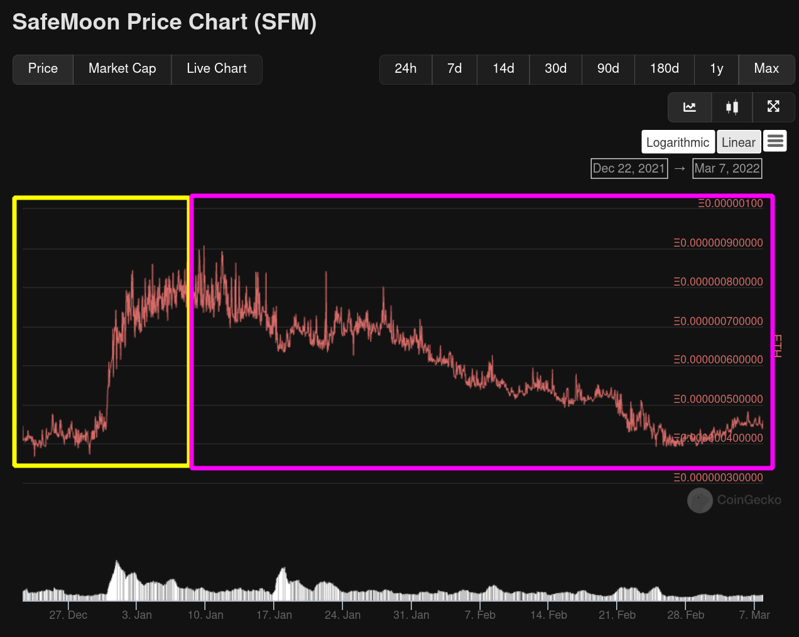
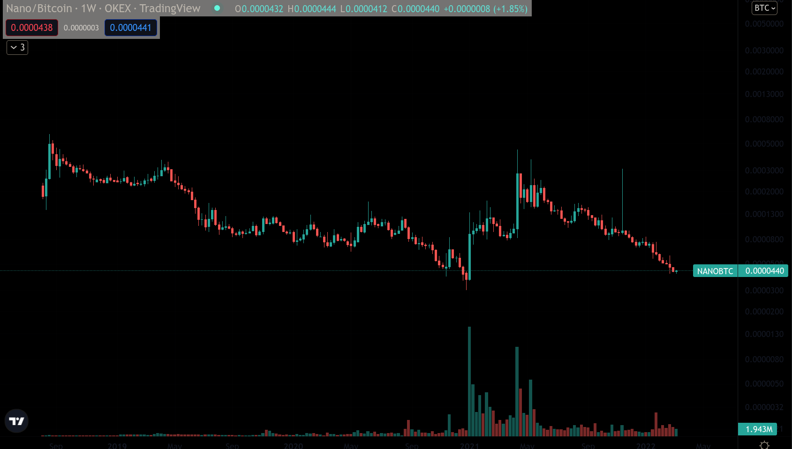

# Analyzing investments in cryptocurrency projects

I happen to really enjoy rolling around in the crypto world. I spend hours and hours researching, not to find specific answers to things, but because I think its _really fucking cool_. Given that many my friends and some acquaintances know how much time I spent researching, I often get asked the question **How do you determine a project is probably a good investment?**. Yesterday, I had a cool conversation about life with my friend César, who phrased this question in a way that gave me a great idea... _write an article about it!_. So here we are again, talking about crypto stuff.

As any human, aside from objective research I've made, I have my own biases and opinions, and like everyone else does, I also apply these to my investment choices. So the answer to the question of **what YOU should invest in** is a question only you can answer. All I'll do in this article is point to resources and details to watch out when investing on crypto projects, because I've heard far too many times the sentence _"Hey i found this really **good** project, you should check it out!"_, and then I check it out and it's just like any other project of its type. Competition is incredibly aggressive and fast on the crypto space, _almost everything_ (more on this later) is open source software, anyone can fork anything and improve it or change it.

***

## Article index

- [Analyzing investments in cryptocurrency projects](#analyzing-investments-in-cryptocurrency-projects)
  - [Article index](#article-index)
  - [Disclaimers](#disclaimers)
  - [Purpose of the project](#purpose-of-the-project)
  - [Questions to answer about any crypto project](#questions-to-answer-about-any-crypto-project)
  - [Open source vs Closed source](#open-source-vs-closed-source)
  - [Token utility](#token-utility)
    - [UNI/ETH Ratio](#unieth-ratio)
    - [1INCH/ETH Ratio](#1incheth-ratio)
    - [CAKE/ETH Ratio](#cakeeth-ratio)
  - [Tokenomics](#tokenomics)
    - [Example: Uniswap tokenomics](#example-uniswap-tokenomics)
      - [UNI token distribution](#uni-token-distribution)
      - [UNI's issues as an investment from the perspective of tokenomics](#unis-issues-as-an-investment-from-the-perspective-of-tokenomics)
      - [How UNI can become more attractive as an investment](#how-uni-can-become-more-attractive-as-an-investment)
    - [Example: Curve tokenomics](#example-curve-tokenomics)
      - [CRV token distribution](#crv-token-distribution)
      - [CRV's advantage over other pure governance tokens like UNI](#crvs-advantage-over-other-pure-governance-tokens-like-uni)
      - [CRV's performance](#crvs-performance)
  - [Weird token mechanics](#weird-token-mechanics)
  - [Blockchain native tokens](#blockchain-native-tokens)
    - [Payment blockchains](#payment-blockchains)
      - [Historical performance vs BTC](#historical-performance-vs-btc)
    - [Smart contract blockchains](#smart-contract-blockchains)
      - [ETH's performance vs BTC](#eths-performance-vs-btc)
      - [Ethereum as the leading blockchain](#ethereum-as-the-leading-blockchain)
      - [Ethereum 'killers'](#ethereum-killers)
      - [The issue with Ethereum 'killers'](#the-issue-with-ethereum-killers)
  - [Project developers](#project-developers)
  - [Glossary](#glossary)
  - [Image sources](#image-sources)

***

## Disclaimers

Some disclaimers I must make before jumping right into it:

- This is **my opinion**, formulated from other people's opinions and lots... lots of reading, and watching the market. I am in no way, shape or form an authority on this, I simply speak from my personal experience, mistakes, successes and things I've read. NONE of what I say here should constituted as financial advice, the way you invest is the way YOU invest. All I'm trying to do with this article is to encourage **doing your own research** or DYOR.

- I've been deeply interested in this world for the past 5 years and have seen lots and lots of disasters, scams, cool projects, as well as massive opportunities, some I've taken advantage of, others I've <a id="boysDontCryLink" onclick="showBoysDontCry()">almost cried</a> over missing.

<audio controls src="./assets/boysdontcry.mp3"> Your browser does not support the <code>audio</code> element.</audio>

- The cryptocurrency market is very speculative, no hypothesis that I or anyone has about the fundamentals or functionality of an application or blockchain will necessarily be reflected on the price.

- Any investment that you make as a direct cause of reading this article is NOT my responsibility, this is risk that YOU and only YOU take.

- If you think all of cryptocurrency is a ponzi scheme or a huge scam, I recommend you read [the following article](https://divethru.com/feeling-stupid-a-guide-to-your-emotions/).

- I am a risk-averse investor, I do not engage with especially obscure projects, and if so I only put a negligible portion of my portfolio there. Full disclosure: Most of my holdings are in ETH.

- Whenever I say that a token or coin is probably not a good investment, it does not mean that there's absolutely anything wrong with the project.

- I do NOT TRADE, almost never, I enter and exit positions in very long timeframes, cutting losses or taking profits when I consider it appropriate according to my analysis. This article is **not for traders**, it's for people looking at crypto projects with the intent to **hold the asset for a long time**. Investments in cryptocurrency can be extraordinarily good for you if you are **patient** and are able to go about your day without looking at the price (or being affected by it)

- When I say "big cryptos", I'm only referring to Bitcoin (BTC) and Ethereum (ETH). Nothing else.

- Investment in cryptocurrency carry additional risk when compared to traditional investments. My focus on this article is to consider **risk-adjusted returns**. Yes, it may be potentially a lot more profitable to invest in a small cap coin with ranks 1000+ when sorted by market cap like on [CoinGecko](https://www.coingecko.com/) as opposed to BTC or ETH, however, this carries additional risk too, scams and abandoned projects are a very common sight in this market so we must be very careful when putting money into these. Returns must either beat or match those of BTC or ETH and remain consistent, if not, you might as well put your money in BTC or ETH given they carry lower risk.
  - This is NOT to say that an investment in BTC or ETH is risk-free, quite the opposite! Also, **no investment is risk-free**, but the risk is certainly lower than when investing in a token like [**DogeCash**](https://www.coingecko.com/en/coins/dogecash) or anything with a Shiba Inu on it (maybe except DOGE? meh)

***

## Purpose of the project

There's projects for all sorts of things, but you must first identify what _the purpose_ of that project is. There's so many different projects out there, so let's try to bundle them and categorize them into a few different sections and provide some examples per category:

- **Payment blockchains** (Ex. Bitcoin, Litecoin, Dash, Nano)
  - Private payment blockchains (Ex. Monero, Zcash)
  
- **Smart contract blockchains** 
  - EVM and EVM-compatible (Ex. Ethereum, Fantom, Gnosis Chain)
  - Non-EVM (Ex. Cardano, Polkadot, Solana, Terra)
  - Rollups (Ex. Arbitrum, Optimism, Metis, Boba)
  - ZK-Rollups (Ex. zkSync, Polygon Hermez)

- **Financial applications**
  - Decentralized exchanges (Ex. Curve, Uniswap)
  - Lending protocols (Ex. AAVE, Compound)
  - Cross-chain and multi-chain asset protocols (Ex. REN, WBTC)
  - Staking protocols (Ex. Lido, StakeWise)
  - Cross-chain/cross-rollup bridges (Ex. Multichain, Hop)
  - NFT gaming (Ex. Axie, Gods Unchained)
  - CDP protocols (Ex. Maker, Abracadabra)
  - Derivatives (Ex. Mirror, Synthetix)
  - Yield (Ex. Convex, Tokemak)
  - Dashboards/asset management (Ex. Instadapp, Defisaver)
  - Lotteries/savings (Ex. Pooltogether)
  - Indexes (Ex. Set protocol, Enzyme)
  - Privacy (Ex. Tornado, Aztec)
  **... etc..**

- **Other types of projects**
  - VPN (Ex. Orchid)
  - Network provider for IOT systems (Ex. Helium)
  - Storage (Ex. Filecoin, Sia)
  **... etc..**

Each one of these categories will have their own specific criteria to consider. I'll focus on the top three, payment blockchains, smart contract blockchains and apps.

## Questions to answer about any crypto project

Some questions I ask myself that I consider apply to every crypto project:

- Is the project [**open source**](#open-source-vs-closed-source)?
  
- Is its token [**useful**](#token-utility)? Is its token **necessary**? If the project didn't have a token, would it impede them from achieving the goal or functionality of the application?

- How are the project's [**tokenomics**](#tokenomics)? Does the token provide any yield or **dividends to holders**? Does the token have any **locking or supply reducing** mechanics? Did the project start its token distribution with an **airdrop**? Is there any **incentive** to hold or use the token that's creating **demand**? How's the **vesting schedule**? How long will it take for the token's supply to be fully diluted?

- Does the token have [**bullshit mechanics**](#weird-token-mechanics) to artificially try and create demand for it while having zero utility whatsoever?

- [**Who**](#project-developers) are the people behind this project? Are they anonymous? Do the owners/developers have a **good track record**? Have they been part of some kind of scam in the past?

- How do the project's **git repositories** look like?

- Is the project **forked** from another successful (or unsuccessful) project?

- Is the token source code **identical** to that of a previous scam? Is the token vulnerable to any **previously discovered vulnerability** that any pas project has suffered?

Let's begin to answer some of these in the following sections. I'll also try to define some terms in the [glossary](#glossary) section, but I will assume the reader has at least extremely basic knowledge of software development (not how to do it, but at least what it entails) and basic economics terminology (supply, demand, inflation, etc...)

***

## Open source vs Closed source

In the non-blockchain world of software, it's OK to use closed source software if it's coming from a trusted source. Sure, it's safer to use open source software, as you can actually _see_ what the piece of software is doing, however, on the blockchain this is **not optional**.

Blockchain applications and blockchains themselves *must* be open source, as they are constantly interacting with users' wallets/funds and any action the user performs when interacting with the blockchain or application is **irreversible**.

The purpose of blockchains is to remove the middleman, to avoid requiring trust. If you go and use an application on the blockchain or a blockchain that requires trust to use, you're exposing yourself to catastrophic financial loss, as unlike with traditional software on your computer, you're still able to stop software as long as you never allow it to have administrative privileges. On the blockchain, after you sign a transaction and the transaction is confirmed/included in a block, **you are never going to be able to reverse it or cancel it**.

If a project is closed source, the project is **not a good project**.

You can check whether a smart contract is closed source or open source in the projects' website or on the block explorer of the blockchain the project is deployed on. Let's take Uniswap for example:

Uniswap is an extraordinarily good example as it has open source smart contracts and an open source web application interface. This way anyone can inspect the code and see if there's any vulnerability or if there's any malicious function.

We should always also make sure that this is also reflected on the deployed contract of the project:

***

## Token utility

Apps and blockchains alike sometimes need a cryptocurrency or token to thrive, encourage growth, govern the protocol, or any sort of utility. However, other times, the token is _basically useless_ or simply not necessary to have. This is (IMO) the first thing to consider when buying a token or investing in a project.

Other times, even if the token has some utility, it simply serves the purpose of governance. Projects with tokens that only serve the purpose of *governance*<a onclick="captureSection('#token-utility')" href="#glossary">[1]</a> are provably **not a good investment** when compared to big cryptos. We can clearly see this when we take a large project's token like UNI (Uniswap), 1INCH (1inch) or CAKE (Pancakeswap, a Uniswap V2 fork) and we take their ratio vs ETH or BTC:

### UNI/ETH Ratio

Looking at the UNI/ETH ratio, we can clearly see how poor of an investment buying UNI tokens would have been at almost any point as opposed to buying ETH. There's many reasons for this, but in particular we can attribute some of the poor performance to the fact that the token does nothing but allow you to vote on proposals.

### 1INCH/ETH Ratio

1INCH tokens have suffered much of the same fate of UNI tokens, yes there are differences, however, just like with UNI, this project started with an airdrop which caused a massive selloff, to then go on to a rally against ETH (meaning the price was going up more and faster than the price of ETH), however, the demand did not quite keep up and the token emissions (inflation) screwed up the price in the long term. This made 1INCH tokens not quite worth holding. We'll get into token emissions and inflation more in the [Tokenomics](#tokenomics) section.

1INCH does have additional utility when compared to UNI, it allows users to get gas fee discounts when trading in the 1Inch *DEX*<a onclick="captureSection('#1incheth-ratio')" href="#glossary">[2]</a> Aggregator, however, 1Inch has not managed to catch the *TVL*<a onclick="captureSection('#1incheth-ratio')" href="#glossary">[3]</a> that Uniswap has managed to retain, so even if 

### CAKE/ETH Ratio

PancakeSwap came to sweep the market as the only DEX on Binance Smart Chain, however, even if some investors managed to do very well when CAKE launched, the trand is identical as with the other previous two projects. The developers of this project did essentially copy another project, Uniswap V2, to deploy it into a functionally centralized chain (when compared to Ethereum), however, there was a lot of development to make PancakeSwap into something more than just 'another DEX', with attractive farming programs and incentives for liquidity providers. It managed to attract a large amount of liquidity and it still holds a quite high position if we list protocols by their TVL.

Regardless of what PancakeSwap has achieved, investing in CAKE was surely a great way to lose money when compared to just straight up buying BTC. As PancakeSwap was positioned weirdly, being in a chain that is [unsustainable in the long term](https://github.com/bnb-chain/bsc/issues/553#issue-1055158659), created with the sole purpose of performing a *vampire attack*<a onclick="captureSection('#cakeeth-ratio')" href="#glossary">[4]</a> on Ethereum, which was largely successful at first, but hardly sustainable in the long term. CAKE is another token that was a victim of its own emissions due to poor [tokenomics](#tokenomics) as well as lack of innovation and utility.

The bottom line here is, if your project's token is not useful, it is likely **not a good investment** when compared to ETH or BTC. You want whatever project you're investing to either **match** the performance of ETH and BTC or to **outperform** them consistently. That's not easy, but it's possible under the right circumstances. We'll see more examples of this later.

***

## Tokenomics

Tokenomics are sometimes the most important consideration to have when investing in a specific cryptocurrency or token. These describe how the token supply will be or currently is distributed, how much the liquidity providers, users and the community will get, how much the investors and developers get, how long it'll take for the token supply to be fully diluted, etc.

The best tokenomics will have several features:

- Application features or incentives that create demand for the token

- A non-one-sided distribution of the token, where investors, while still get a significant portion of the supply, don't completely swallow it

- Application features that encourage locking the token for an extended period of time in exchange for benefits like additional rewards for providing liquidity

- A slow enough release schedule as to not absolutely overwhelm and flood the market with tokens. Inflation should be controlled, if existent

- A mechanism to remove tokens from the supply, either by locking the tokens or by straight up burning them

The token will have as much demand as the project is able to attract liquidity right? Except that with bad tokenomics it doesn't even matter if the project attracts a monstruous amount of liquidity, investing in the token is **not worth it**. 

Before strongly judging a project's tokenomics and making a choice, consider that they are **not fixed**, tokenomics can change, new locking mechanisms or incentives can be created. The great thing about an economy powered by permissionless immutable code is that we can build on top of that code, we can upgrade that code in future deployments (as previous deployments are immutable), we can create additional contracts to create new modules on top of currently built code. This makes considering tokens with subpar or straight up terrible performance in terms of returns a potential attractive investment given that an interesting or worthwhile upgrade is introduced.

Let's look at some example tokenomics, outline strenghts and weaknesses and perhaps consider some possible future changes to the tokenomics or future mechanics to be introduced that could possibly remedy poor price action and performance vs ETH or BTC.

### Example: Uniswap tokenomics

Uniswap is a DEX, it allows users to trade assets in a permissionless manner, as well as create trading pairs and provide liquidity to existing trading pairs. Uniswap released their token in Q4 2020 through an *airdrop*<a onclick="captureSection('#example-uniswap-tokenomics')" href="#glossary">[5]</a>. The airdrop gave away 400 UNI tokens to each and every wallet that ever interacted with the protocol, whether the trade was successful or the transaction executing the trade failed. 

#### UNI token distribution

<figcaption><a href="https://uniswap.org/blog/uni" class="imageSource" target="_blank">Image source</a></figcaption>

This, as far as tokenomics distributions go is alright, 60% going to the community is good. Uniswap is fairly recognized in the community so the proportion given to investors is not massive, 17.8% for investors is not ridiculous or excessive by any means when compared to other similar applications.

This is the genesis allocation though, as more tokens are released on the market, the proportions will change slightly, but not significantly, therefore this chart is sufficient to describe the allocations. 

<figcaption><a href="https://uniswap.org/blog/uni" class="imageSource" target="_blank">Image source</a></figcaption>

The release schedule also seems quite standard. But as with any *new* token, we have to consider the possibility that inflation will exist until the full supply is out there, meaning that if demand for it does not rise, and there's not inherent mechanic to reduce supply or increase demand, the token will NOT perform well when compared to ETH or BTC. Again, if you're going to invest in a project, no matter how 'good' you perceive it, the investment may not be good enough because of inflation. Inflation is baked into new tokens, they need to eventually become fully diluted or have good mechanics before you should consider an investment in them.

#### UNI's issues as an investment from the perspective of tokenomics

Uniswap's token UNI at the time does nothing but allow for active participation in governance, like shares in a company. **There is no mechanic to**:

- Distribute protocol revenue to holders

- Lock UNI tokens or remove them from the supply
  
- Increase demand for the token

Therefore holding UNI is potentially shooting yourself in the foot. Uniswap is a formidable, trusted, revolutionary, useful and amazing project, but this does not mean that buying UNI is a good idea. 

#### How UNI can become more attractive as an investment

Despite this, and as I mentioned before, the lack of existence of these mechanics doesn't necessarily condition their future existence. A way to keep up with whether these mechanics will exist or have been proposed by prominent community members or developers is to look at the [governance forum for Uniswap](https://gov.uniswap.org/). Before implementing anything on the blockchain, several steps need to be achieved, at least in the case of highly secure, audited protocols (the ONLY kind of project you should ever invest in) like Uniswap:

1. Either a discussion thread about any implementation of these mechanics is created and prominent community members, developers, investors or simple users discuss them. This could happen before a formal forum proposal thread is made, or in the same thread as the proposal. The proposal is then actively discussed in the forum.

2. Given overwhelming support in the forums, some entity or person develops the code to create a formal proposal to be voted on on-chain in the [Uniswap governance interface](https://app.uniswap.org/#/vote?chain=mainnet). The formal proposal **requires** coding a smart contract or calling a set of functions in the formal Uniswap smart contracts (or other contracts), the set of actions has to be programmed, this is why the governance is decentralized, because IF the quorum is met AND the vote passes, the action is executed on-chain, and no one can change it once it passes. If it does NOT pass, then nothing happens.

If the actions in step 2 require an additional contract, a formal audit may be made before creating the vote on-chain, this costs money, maybe financed by the protocol treasury or by an external entity, but also takes **time**. Therefore any change occurring to any prominent project's tokenomics is a SLOW process, and may require even several different forum discussions about it, as well as individuals to actually code what will (or won't) occur when the vote passes.

### Example: Curve tokenomics

Curve Finance is a decentralized exchange that has been especially popular for stablecoin pools. Given the variety of stablecoins like USDT, USDC, DAI, UST... a need for a more robust stablecoin decentralized exchange was created. Uniswap and other decentralized exchanges still work for stablecoin swaps. There's large pools for this on Uniswap V3 as well that trade between assets in pairs like USDC/DAI, however, Curve's approach is different and allows for multi-asset pools as opposed to just pairs as well as keeping the price peg between stablecoins in a much more efficient way, with much lower slippage and fees. 

It's important to note Uniswap V3 has fixed much of the faults of Uniswap V2 that Curve has improved significantly, but the big differentiator for Curve as opposed to Uniswap and the reason why it's attracted so much more liquidity is its CRV token and the outstandingly good tokenomics it boasts.

Aside from stablecoins, Curve is very effective in pairing assets that are wrapped or represented by another token, providing utility in other projects, for example Alchemix's alETH, StakeWise's sETH2, etc... These are assets that either should always be represented by the value of ETH or are supposed to be pegged 1:1 with ETH (or as close as possible) due to other mechanics. The idea here is that Curve is a fantastic tool for stable pools, whether those are stablecoins or other stable pairs.

#### CRV token distribution

Knowing this, we can go into why Curve has attracted so much liquidity aside from the efficiency of its stable pools, and that's the tokenomics of CRV, Curve's native token. Let's first check out the distribution of CRV:

This looks fairly standard, however, let's notice how the initial supply of CRV was distributed:

Here we can see several interesting features which differentiate CRV as a governance token:

- The CRV allocation for liquidity providers is *vested*<a onclick="captureSection('#crv-token-distribution')" href="#glossary">[6]</a>, meaning they can't sell it until after a year.

- There's no instantly massive release of a significant amount of the supply, but rather a 2M release per day.

- The primary objective of CRV is to put LPs first.

#### CRV's advantage over other pure governance tokens like UNI

**Much** more important than just the distribution are the amazing **features** of CRV:

- CRV can be locked for 1 week, 1 month, 3 months, 6 months, 1 year or 4 years and people that lock their CRV will get back veCRV back, which has several features:
  
  - veCRV holders can vote on governance proposals, as opposed to CRV holders, the longer the lock period, the larger the voting power.
  
  - veCRV holders can boost the CRV rewards they get from providing liquidity on Curve pools significantly (up to 2.5x the normal reward amount in CRV).
  
  - veCRV holders earn 50% of the trading fees in Curve pools in the form of 3CRV LP tokens, which represent the underlying liquidity for the 3Pool. A pool composed of the DAI/USDC/USDT stablecoins that gets a lot of use in large trades. At the time of writing, this pool has ~20M dollars worth of daily trading volume and has about 4B dollars worth of liquidity.
  
  - veCRV holders decide where CRV incentives are allocated in Curve, so there's an incentive from external projects that have their liquidity on Curve to bribe (or rather pay) veCRV holders for the service of directing CRV rewards to their pools.

These rewards are then further incentivized by other projects that try to take advantage of this system to reward users that provide liquidity even further. Without getting into much more detail about these mechanics we can analyze them closely and see why CRV tokenomics are excellent:

- CRV can be locked to get the benefits of veCRV, so CRV has a mechanic to take tokens out of the supply for a significant period of time.

- CRV earns protocol fees in the form of 3CRV, so CRV has a mechanic to pay dividends to holders.

- veCRV can be used to vote to direct incentives to pools, so CRV has a mechanic to create demand to buy it in order for projects to attract liquidity.

These seem trivial, but given the innovation of Curve and how popular it is for pooling stable assets, it's become a very popular go-to option for other projects to set up their liquidity pools and even spawning other projects with the sole purpose of controlling CRV incentives to pools.

#### CRV's performance

As a result of Curve's success as a decentralized exchange and the subsequent success of its CRV incentives and great CRV tokenomics, the performance of CRV has been on-par with that of ETH:

As well as BTC:

With the exception of the starting 2 months, when the token was released given the initial high inflation, but as Curve became more and more popular and more and more projects decided to establish their pools in the protocol, this has made CRV another **solid token to hold** in combination to ETH and BTC.

***

## Weird token mechanics

Following tokenomics, we can make a short section dedicated to 'weird mechanics', tokens that have deliberate mechanics to artificially try to create demand, even when the token serves absolutely no purpose. Some of the mechanics most quasi-scam projects will use are:

- **Loud claims of having a 'deflationary' token distribution**: Using basic law of supply and demand we know that given a decreasing supply and increasing demand, the price of an asset should rise. However, when the token serves no purpose no matter how 'deflationary' the distribution is, the price will not increase unless some artificial demand is created.

  - Example: 'SAFEMOON', a token that has a deflationary mechanic, but again, no utility at all. Rose very prominently in January 2021, but given how useless it is, anyone that didn't buy before the hype period and initial rise (yellow) ended up losing money in the subsequent period where investors realized this token is pretty much useless (fuchsia):

 

- **Additional transaction fees when buying/selling**: If the token's supply is reduced and distributed to other holders of the token upon transacting with the token (sending it) or upon buying/selling the token, then there's an incentive to not sell the token. Yeah, no. Usually projects will use this kind of bullshit mechanic so that people don't sell it, but people will sell it, even at a loss.

  - Example: Fees.wtf's token 'WTF'. Released through an airdrop which anyone could theoretically sell after receiving, this tactic was used to encourage holding or buying and holding the token. Needless to say, this approach did not quite work well as we can see by the token's performance:

Either way, the devil is in the details, bullshit mechanics to create temporary artificial demand is only gonna benefit a few and it's gonna make a lot of people lose their money. If a token is hot on social media and gaining a lot of traction, you're most likely already too late to the bandwagon and have already lost your chance to profit off of it.

<figure>
  
  <figcaption><i>Tell me you're a scam without telling me you're a scam</i></figcaption>
</figure>

***
## Blockchain native tokens

Since the initial release of the Bitcoin white paper and its creation, there's been a lot of different blockchains with different purposes. In particular, we've come to classify them by their purpose. To keep this article within scope, I want to only focus on two types of blockchains: **Payment blockchains** and **Smart contract blockchains**.

### Payment blockchains

<figcaption><a href="https://bitcoin.org/en/" class="imageSource" target="_blank">Image source</a></figcaption>

Payment blockchains allow you to send and receive cryptocurrency. Their functionality is simple even if the underlying technology is extremely complex. The 'original' payment blockchain is the Bitcoin blockchain, through which we can send and receive Bitcoin's native token BTC.

BTC is potentially the best investment in the history of humanity if purchased when it launched in 2009 and held until today. However, a lot of people came to know BTC through other similar projects (and their native tokens) like:

- Litecoin (LTC)
- Dash (DASH)
- Dogecoin (DOGE)
- Nano (NANO)

  .. among others.

<figcaption><a href="#image-sources" class="imageSource">Image sources</a></figcaption>

These projects do the exact same thing Bitcoin attempts to do, but 'cheaper' and 'more efficiently'. However, while well known, relatively innovative and with large communities of their own, they are an investment very difficult to justify for several reasons:

- Bitcoin was the first proof of concept that we can have a digital currency in a decentralized distributed network secured by cryptography (blockchain), these other Bitcoin 'alternatives' do not exactly provide any new functionality, they are simply 'cheaper', but hardly recognized like Bitcoin is.

- Large investors, institutions and those with the capital to be able to push the price of an asset up are probably not going to seriously consider an investment in a 'Bitcoin alternative' like Litecoin. Their portfolios hold Bitcoin, not Litecoin, and they will not use Bitcoin for payments, they will use it as an investment. Whether Bitcoin suceeded or failed in the task of becoming a 'worldwide digital currency' as of 2022 is hardly relevant.

- Their historical performance when compared to Bitcoin is just 'meh', let's look at some charts.

#### Historical performance vs BTC

In this section I want to highlight that when I refer to poor historical performance vs BTC, I'm not trying to say you "can't make money with these", but I do not trade in short timeframes, so good performance of any of these assets vs BTC during a short period of 1-3 weeks is probably not going to be something I can catch *on time*. 

- **DASH/BTC**, meh.

- **LTC/BTC**, good start, *mediocre overall*.

- **NANO/BTC**, there was a period where holding it could've earned you a lot as opposed to holding BTC, but for the most part, the trend is down with the exception of that period. If you think this thing is going to take off, that's okay, but I don't see that happening for now and would rather hold BTC.

- **DOGE/BTC**, so what? I made a mistake? what are you gonna do about it huh? Doge has historically performed *pretty well* against BTC, being mostly a sideways dance with some spikes in specific moments, whenever it gets 'hot again'. Don't be deceived by this chart though, the investment is alright if we consider its historical performance, but the token is a meme, it has infinite supply and there's like 50 wallets that control the overwhelming majority of the supply. "But Daniel you could also say that about BTC!!", then buy DOGE man, it's OK, I also think the lil dog is kinda cute too, good luck trying to catch those spikes though!
 

Note, I am not trying to argue that you **shouldn't buy any of these**, I'm just saying, the priority is maximizing **risk-adjusted returns**, BTC is just less risky than these and it's what makes these assets go up because they are all more than 95% correlated to BTC. BTC moves them, not the other way around!

### Smart contract blockchains

<figcaption><a href="https://iconarchive.com/show/cryptocurrency-flat-icons-by-cjdowner/Ethereum-ETH-icon.html" class="imageSource" target="_blank">Image source</a></figcaption>

In late 2013, Vitalik Buterin described Ethereum in a white paper. The project was created with the purpose of building decentralized applications and during its initial founding and development it had some extremely prominent leaders of other projects on board, among those Gavin Wood and Charles Hoskinson both founders of similar projects with different approaches to smart contracts.

The Ethereum blockchain had a specific advantage over the Bitcoin blockchain in that it could host smart contracts as opposed to just addresses. Smart contracts are essentially a script, the script's functions can be called from a web interface that connects to the blockchain through a javascript library called web3.js through a local or remote ethereum node. Allowing for the creation and execution of applications that interact with the blockchain.

The result of this is a robust ecosystem of mostly financial applications and a blockchain that supports more functionality than just sending and receiving payments, but rather all sorts of cool things like lending and borrowing, decentralized exchanges, etc.

Ethereum's native asset ETH serves as the currency to cover costs for using these applications. Whenever there's a transaction, an amount of ETH must be paid. When interacting with a smart contract in any decentralized application, a set of instructions run in the Ethereum Virtual Machine and a cost is charged to the user based on what and how many operations were performed.

#### ETH's performance vs BTC

ETH as an asset has had mostly good performance vs BTC, with periods where BTC clearly is a better investment and periods where ETH is a better investment, however, for the most part we can see that the trend is up, especially after late 2019.

ETH did not have the same recognition in the media as BTC, therefore didn't attract as many buyers, but perhaps due to its lower market cap at the time and therefore higher volatility, returns were higher (or losses if you liked trading but weren't good at it). Since 2019 or so though, ETH has outperformed BTC significantly given how quickly the development of financial applications has ramped up.

#### Ethereum as the leading blockchain

As a result of increased development activity and innovation happening on Ethereum, it is now the leading blockchain by several important metrics:

- Amount of developers and development activity (Events on the official github repo excluding comments, forks, stars...)

<figcaption><a href="https://app.santiment.net/charts?settings=%7B%22slug%22%3A%22bitcoin%22%2C%22ticker%22%3A%22BTC%22%2C%22from%22%3A%222021-09-08T21%3A59%3A59.999Z%22%2C%22to%22%3A%222022-03-08T22%3A59%3A59.999Z%22%7D&widgets=%5B%7B%22widget%22%3A%22ChartWidget%22%2C%22wcsa%22%3Atrue%2C%22metrics%22%3A%5B%22ethereum_MC_ETH_MC_dev_activity%22%2C%22dev_activity%22%2C%22cardano_MC_ADA_MC_dev_activity%22%2C%22solana_MC_SOL_MC_dev_activity%22%2C%22avalanche_MC_AVAX_MC_dev_activity%22%2C%22binance-coin_MC_BNB_MC_dev_activity%22%2C%22luna_MC_LUNA_MC_dev_activity%22%2C%22cosmos_MC_ATOM_MC_dev_activity%22%5D%2C%22axesMetrics%22%3A%5B%22dev_activity%22%5D%2C%22colors%22%3A%7B%22ethereum_MC_ETH_MC_dev_activity%22%3A%22%23F47BF7%22%2C%22dev_activity%22%3A%22%238358FF%22%2C%22cardano_MC_ADA_MC_dev_activity%22%3A%22%23FF5B5B%22%2C%22solana_MC_SOL_MC_dev_activity%22%3A%22%23FFCB47%22%2C%22avalanche_MC_AVAX_MC_dev_activity%22%3A%22%235275FF%22%2C%22binance-coin_MC_BNB_MC_dev_activity%22%3A%22%23FF8450%22%2C%22luna_MC_LUNA_MC_dev_activity%22%3A%22%23785549%22%2C%22cosmos_MC_ATOM_MC_dev_activity%22%3A%22%23D4E763%22%7D%2C%22settings%22%3A%7B%22ethereum_MC_ETH_MC_dev_activity%22%3A%7B%22interval%22%3A%221d%22%2C%22transform%22%3A%7B%22movingAverageBase%22%3A42%2C%22type%22%3A%22moving_average%22%7D%7D%2C%22dev_activity%22%3A%7B%22interval%22%3A%221d%22%2C%22transform%22%3A%7B%22movingAverageBase%22%3A42%2C%22type%22%3A%22moving_average%22%7D%7D%2C%22cardano_MC_ADA_MC_dev_activity%22%3A%7B%22transform%22%3A%7B%22movingAverageBase%22%3A42%2C%22type%22%3A%22moving_average%22%7D%7D%2C%22solana_MC_SOL_MC_dev_activity%22%3A%7B%22transform%22%3A%7B%22movingAverageBase%22%3A42%2C%22type%22%3A%22moving_average%22%7D%7D%2C%22avalanche_MC_AVAX_MC_dev_activity%22%3A%7B%22transform%22%3A%7B%22movingAverageBase%22%3A42%2C%22type%22%3A%22moving_average%22%7D%7D%2C%22binance-coin_MC_BNB_MC_dev_activity%22%3A%7B%22transform%22%3A%7B%22movingAverageBase%22%3A42%2C%22type%22%3A%22moving_average%22%7D%7D%2C%22luna_MC_LUNA_MC_dev_activity%22%3A%7B%22transform%22%3A%7B%22movingAverageBase%22%3A42%2C%22type%22%3A%22moving_average%22%7D%7D%2C%22cosmos_MC_ATOM_MC_dev_activity%22%3A%7B%22transform%22%3A%7B%22movingAverageBase%22%3A42%2C%22type%22%3A%22moving_average%22%7D%7D%7D%2C%22combinedMetrics%22%3A%5B%5D%7D%5D" class="imageSource" target="_blank">Image source</a></figcaption>

- Value settled through the network (Including tokens on Ethereum)

<figcaption><a href="https://money-movers.info/" class="imageSource" target="_blank">Image source</a></figcaption>

- Daily transaction fees for securing the network (Earnings to miners/stakers)

<figcaption><a href="https://cryptofees.info/" class="imageSource" target="_blank">Image source</a></figcaption>

- Amount of money locked in applications on the blockchain (TVL)

<figcaption><a href="https://defillama.com/chains" class="imageSource" target="_blank">Image source</a></figcaption>

- Size of its layer 2 ecosystem in terms of both development, VC funding, TVL, etc... There's a big incentive to scale Ethereum at the moment given its high activity and high level of decentralization

<figcaption><a href="https://l2beat.com" class="imageSource" target="_blank">Image source</a></figcaption>

- Decentralization and network security as opposed to other smart contract blockchains 

<figcaption><a href="https://stakers.info/" class="imageSource" target="_blank">Image source</a></figcaption>

**Note:** this validator count is for Ethereum on proof of stake, however, after *the merge*<a onclick="captureSection('#ethereum-as-the-leading-blockchain')" href="#glossary">[7]</a> somewhere around Q2 2022 this will be the effective validator count for Ethereum. 

#### Ethereum 'killers'

<figcaption><a href="#image-sources" class="imageSource">Image sources</a></figcaption>

Since Ethereum became the leading platform to develop smart contracts in, and since it remains the leading platform for it, several other projects have spawned to attempt to solve its main problem: high transaction fees.

High transaction fees are obviously a major problem. These occur when the blockchain is experiencing high activity from users, and due to this extreme demand of block space on Ethereum, blocks can fill up quite quickly. This causes fees required to pay for a transaction to increase significantly in order to be fit in blocks, as miners automatically mine the highest-paying transactions.

The scalability issue makes transacting on Ethereum potentially prohibitively expensive. As a result, users looking for investment opportunities, high yields or just experimenting with applications have flocked to projects that promise 'cheap transactions'.

These new 'Ethereum killers' not only have attracted users looking to transact on the cheap, but also large venture capital firms looking to invest in them early on in order to profit as much as possible from potential growth of these platforms.

#### The issue with Ethereum 'killers'

These new platforms trade transaction costs for other potentially more problematic and risky issues like:

- **Lack of decentralization**: 
  
- Lack of spam mitigation (the transactions are cheap, so it's easy to congest the network), uptime, costs for network validators, excessive fraudulent activity from rogue developers, etc.

***

## Project developers

***

## Glossary

<a id="goBackToReadingSection" onclick="goBackToReadingSection()">Go back to the section you were reading when you clicked to come here ⬆</a>

- **Governance**: When a token serves the purpose of 'governance' it means that it works as a share of a company, allowing you as a token holder to vote on proposals made by other community members or developers. The voting for this proposal typically happens on-chain and when a proposal passes, when the voting time is over there is a transaction that occurs on-chain with effects on the project contract as described on the proposal. 

- **DEX**: Decentralized exchange. It's an application on the blockchain that allows users to trade tokens in trading pairs (or asset bags in the case of Curve or Balancer). Trades on a DEX are permissionless and no central entity controls the liquidity in them (as opposed to centralized exchanges)

- **TVL**: Total value locked. It's the sum of all assets locked in a protocol. It's important to note here that the value is not exactly 'locked', it's just contained in the protocol's smart contracts. Normally depositors can always withdraw whenever they want.

- **Vampire attack**: When a project is created with the sole purpose of stealing liquidity and user activity from another by giving users a more comfortable/faster/cheaper way to transact or providing additional incentives as opposed to a competing project. Ex. SushiSwap on Uniswap in Q4 2020 (providing bigger incentives to LPs), or BSC (Binance Smart Chain) on Ethereum in Q1 2021 (providing cheaper gas fees at the cost of security, decentralization, long-term sustainability and spam mitigation).

- **Airdrop**: An airdrop is an event where a project allocates and distributes a specific amount of its supply to non-insiders (investors, developers) and releases this portion of the supply to previous users, liquidity providers or even people that apply to it.

- **Vesting period**: The vesting period is the period of time in which an investor or token recipient, after making an investment or participating in a protocol, is unable to sell their vested tokens. The tokens may be in their wallet already or they may take a while to be received or for it to be possible to claim them or sell them in the open market.

- **The merge**: Scheduled upgrade to the Ethereum network where the current Ethereum blockchain (Proof of Work) will merge with the Beaconchain (Proof of Stake), thereby effectively 'switching' the consensus mechanism of Ethereum to proof of stake. The event also carries out several interesting monetary policy changes to the ethereum network.

***

## Image sources

I typically source these in order but I'll reference them with a description since I have created some images and I'm not keeping track of image order in this post.

- Uniswap tokenomics images: [Introducing UNI blog post on Uniswap.org](https://uniswap.org/blog/uni)

- Bitcoin logo: [bitcoin.org homepage](https://bitcoin.org/en/)

- Litecoin logo: [Wikipedia litecoin article](https://es.wikipedia.org/wiki/Litecoin)

- Dash logo: [Logos download.com](https://logos-download.com/26510-dash-logo-download.html)

- Dogecoin logo: [Coinmarketcap dogecoin page](https://coinmarketcap.com/es/currencies/dogecoin/)

- Nano logo: [mrgrench420's upload on pinterest](https://www.pinterest.com/pin/412501647121246242/)

- Ethereum logo: [iconarchive.com](https://iconarchive.com/show/cryptocurrency-flat-icons-by-cjdowner/Ethereum-ETH-icon.html)

- Development activity chart: [Santiment app custom selection for dev activity](https://app.santiment.net/charts?settings=%7B%22slug%22%3A%22bitcoin%22%2C%22ticker%22%3A%22BTC%22%2C%22from%22%3A%222021-09-08T21%3A59%3A59.999Z%22%2C%22to%22%3A%222022-03-08T22%3A59%3A59.999Z%22%7D&widgets=%5B%7B%22widget%22%3A%22ChartWidget%22%2C%22wcsa%22%3Atrue%2C%22metrics%22%3A%5B%22ethereum_MC_ETH_MC_dev_activity%22%2C%22dev_activity%22%2C%22cardano_MC_ADA_MC_dev_activity%22%2C%22solana_MC_SOL_MC_dev_activity%22%2C%22avalanche_MC_AVAX_MC_dev_activity%22%2C%22binance-coin_MC_BNB_MC_dev_activity%22%2C%22luna_MC_LUNA_MC_dev_activity%22%2C%22cosmos_MC_ATOM_MC_dev_activity%22%5D%2C%22axesMetrics%22%3A%5B%22dev_activity%22%5D%2C%22colors%22%3A%7B%22ethereum_MC_ETH_MC_dev_activity%22%3A%22%23F47BF7%22%2C%22dev_activity%22%3A%22%238358FF%22%2C%22cardano_MC_ADA_MC_dev_activity%22%3A%22%23FF5B5B%22%2C%22solana_MC_SOL_MC_dev_activity%22%3A%22%23FFCB47%22%2C%22avalanche_MC_AVAX_MC_dev_activity%22%3A%22%235275FF%22%2C%22binance-coin_MC_BNB_MC_dev_activity%22%3A%22%23FF8450%22%2C%22luna_MC_LUNA_MC_dev_activity%22%3A%22%23785549%22%2C%22cosmos_MC_ATOM_MC_dev_activity%22%3A%22%23D4E763%22%7D%2C%22settings%22%3A%7B%22ethereum_MC_ETH_MC_dev_activity%22%3A%7B%22interval%22%3A%221d%22%2C%22transform%22%3A%7B%22movingAverageBase%22%3A42%2C%22type%22%3A%22moving_average%22%7D%7D%2C%22dev_activity%22%3A%7B%22interval%22%3A%221d%22%2C%22transform%22%3A%7B%22movingAverageBase%22%3A42%2C%22type%22%3A%22moving_average%22%7D%7D%2C%22cardano_MC_ADA_MC_dev_activity%22%3A%7B%22transform%22%3A%7B%22movingAverageBase%22%3A42%2C%22type%22%3A%22moving_average%22%7D%7D%2C%22solana_MC_SOL_MC_dev_activity%22%3A%7B%22transform%22%3A%7B%22movingAverageBase%22%3A42%2C%22type%22%3A%22moving_average%22%7D%7D%2C%22avalanche_MC_AVAX_MC_dev_activity%22%3A%7B%22transform%22%3A%7B%22movingAverageBase%22%3A42%2C%22type%22%3A%22moving_average%22%7D%7D%2C%22binance-coin_MC_BNB_MC_dev_activity%22%3A%7B%22transform%22%3A%7B%22movingAverageBase%22%3A42%2C%22type%22%3A%22moving_average%22%7D%7D%2C%22luna_MC_LUNA_MC_dev_activity%22%3A%7B%22transform%22%3A%7B%22movingAverageBase%22%3A42%2C%22type%22%3A%22moving_average%22%7D%7D%2C%22cosmos_MC_ATOM_MC_dev_activity%22%3A%7B%22transform%22%3A%7B%22movingAverageBase%22%3A42%2C%22type%22%3A%22moving_average%22%7D%7D%7D%2C%22combinedMetrics%22%3A%5B%5D%7D%5D)

- Value settled per blockchain (BTC and ETH): [money-movers.info](https://money-movers.info/)

- Fees paid for using blockchains: [cryptofees.info](https://cryptofees.info/)

- TVL per blockchain: [DefiLlama chains section](https://defillama.com/chains)

- TVL for Ethereum rollups: [L2Beat](https://l2beat.com)

- Validator count for PoS and dPoS chains: [stakers.info](https://stakers.info/)

- Binance coin logo: [seeklogo.com](https://seeklogo.com/free-vector-logos/binance)

***

**Date: March 6th, 2022**
