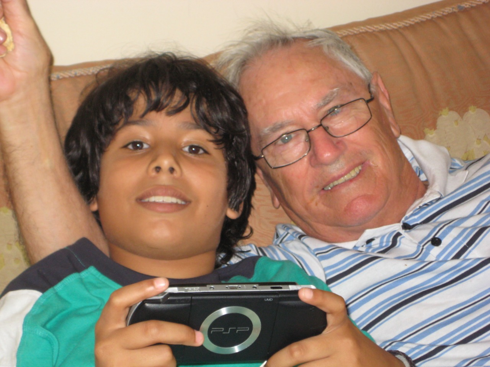

# Gracias, yayo

<b>December 12, 2022</b>

Desde que nací, viste algo especial en mi. No se qué viste, pero te llevó a tratarme como si fuera más que un simple nieto. Te ocupabas de mi más allá de lo que mis padres necesitaban cuando eran más jóvenes y estaban emprendiendo. Fuiste una persona ejemplar de la que estoy increíblemente orgulloso.

Apasionado de la aviación, amante de tu trabajo y en sí extremadamente trabajador. Te dedicaste por tu familia, por tus hijas, y por tu mujer. Un excelente padre de familia, preocupado y a quien tus hijas quieren una barbaridad. Alguien que irradiaba positivismo desde la primera interacción y continuamente hasta la última.

Admiro tu forma de ser, tu dedicación, tu pasión por el fútbol, amor a tu país y a la vez apreciación por otros países, lo abierto que te mostrabas ante cosas que no sabías incluso a tu elevada edad. Siempre me preguntabas cosas que no entendías, sea de tecnología o de lo que fuese y siempre respetabas mi opinión, tanto que me la pedías regularmente. Nunca olvidaré nuestras conversaciones luego de comer, durante los partidos, cuando leías noticias ordinarias o de gran impacto. Hablar contigo siempre fue agradable y lo extraño un montón.

La mejor decisión que pude tomar fue venir a vivir contigo en Agosto 2020. Pasar los últimos 2 años de tu vida, aunque de manera no siempre concurrente contigo y con la yaya. Han sido dos años maravillosos donde siempre me hiciste sentir en casa hasta que hoy día la considero mi casa, cosa que pensaba que no pasaría, pero ha pasado.

Me has acompañado junto con la yaya en lo que han sido 2 años inicialmente muy solitarios. Yo acostumbrado a ver mis amigos con regularidad a pasar a ver a los pocos amigos que aquí tengo unas pocas veces al mes como mucho. Muchas veces sufrí en silencio, porque así soy, y muy atinadamente, porque parece que soy malo ocultándolo o eres bueno determinándolo, me preguntabas si estaba bien. Casi nunca te equivocabas, regularmente me preguntabas si estaba bien, y casi siempre que preguntabas no lo estaba. Sabías leer mis expresiones como poca gente ha sabido y me conocías bien. Tu preocupación la agradezco mucho. Me cuidaste mejor de lo que te cuidé yo a ti, y por eso te agradezco y lo siento mucho. Me habría gustado comunicarme más contigo aunque siempre oculte mis emociones, tu siempre tendrías una cosa razonable que decir. Creo que en eso nos parecemos, creo que ocultarías la intensidad de tu sufrimiento y tristeza para que los demás no se preocupen, pero te merecías que todos estuviésemos atentos a ti en todo momento. Así de bueno eres.

Aprendí a estar solo, a valerme por mi mismo, a cocinar cada vez más y a disfrutar hacerlo. Prepararte a ti filetes de lo que fuese, sazonándolos tratando de que la combinación de especias que utilizara fuera una que te gustara. Siempre te gustaban, aunque sólo tuviese sal. Siempre me dabas tu crítica constructiva, si está seco, si le falta sal, lo que fuese, espero que terminaran siendo de tu agrado, porque siempre te mereces lo mejor.

Y tengo tanto por lo que agradecerte y de qué disculparme. Sé que me perdonarías por cualquier cosa, y eso es una de las cosas que admiro de ti, sabías perdonar incluso antes de que te digan perdón. Eres gran parte de mi hoy día. Has definido una gran porción de mi carácter. Todo puede ser una broma y todo *debe* ser una broma, sino como sobrellevamos lo malo?

Así como le dije a Diego el día del velorio una tontería que sé que a ti te haría reír y es que la selección española te mató, porque el día que perdieron falleciste. Lo digo sin reírme, porque que no estés con nosotros no me hace nada de gracia, pero a ti esa tontería te haría reír. Ante adversidad siempre sabías poner una sonrisa, decir bueno ya está, se resuelve y seguimos. El único obstáculo que te paraba era tu salud, y aún asi fuiste a Málaga en verano para acompañar a la yaya aunque no quisieras. Decías que no querías pero terminabas haciéndolo porque siempre pusiste a los demás y especialmente a la yaya antes que a ti. Habrán ocasiones en las que no, pero las más importantes, en las que más valía y contaba tu presencia, estuviste. Protestabas, pero llegaba el momento y lo hacías. Estabas cansado y te sentías deteriorado pero si te lo pedían, lo hacías.

Gracias por todo yayo. Gracias por tu paciencia, tu preocupación, tu atención, tus intereses, tu amor incondicional a todos nosotros, tu deseo de compartir tu pasión del fútbol conmigo, tu tan notable presencia, tu compañía. Gracias por pedirme ayuda cuando la necesitaste y por preocuparte por aprender a hacer las cosas para las cuales me pedías ayuda. Gracias por acompañarme a veces al desayunar y regularmente al comer y cenar. Hoy me siento al lado de tu silla por que para mi sigues ahí, nunca te vas.

Lamento no haber estado ahí para ti y haberme ido de viaje en noviembre, debí brindarte compañía, debí ver los partidos del mundial contigo. Mi consuelo es que estuve estos últimos dos años contigo, pero a la vez debí pasar esas dos semanas contigo, esas eran las que más contaban y estuve ausente. No me culpo por nada, sé que no querrías que me culpe por nada, sé que lo que querías era mejorarte y que muy claramente no querías "molestar" a nadie, pero te quise mucho yayo, te merecías mi ayuda, la de todos y mucho más. Espero haber sido algo positivo para ti siempre y en especial estos últimos dos años. Te quiero mucho y siempre te querré. Te extraño mucho y siempre te extrañaré. Nunca te olvidaremos. Nunca te olvidaré.

Descansa en paz, mi querido yayo.
