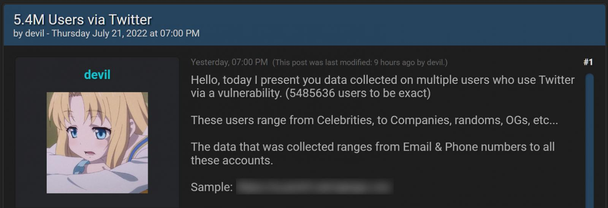
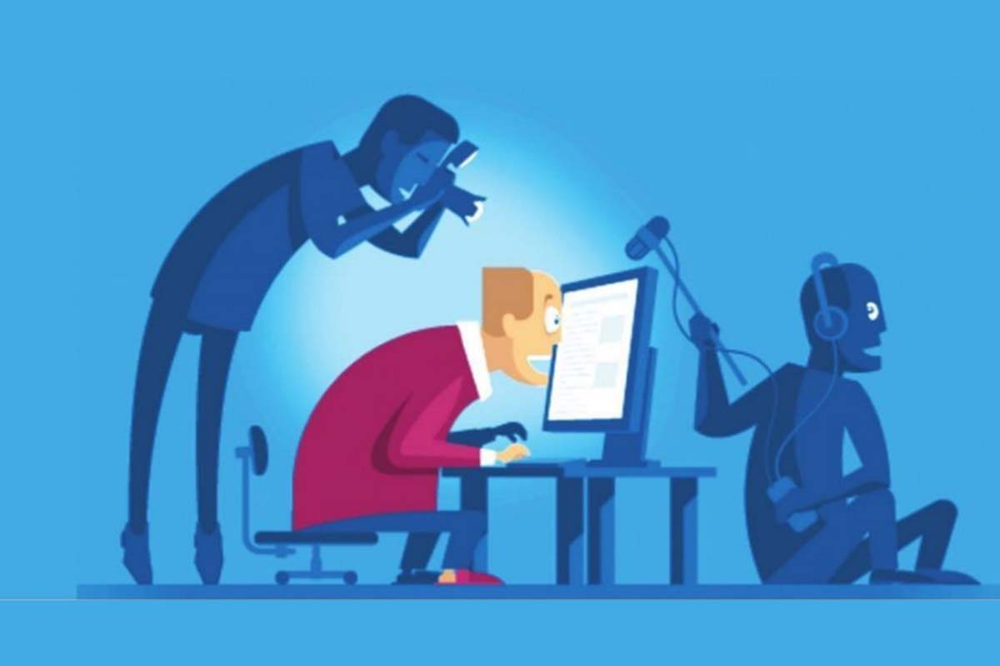
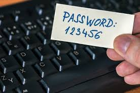
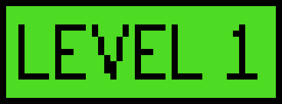
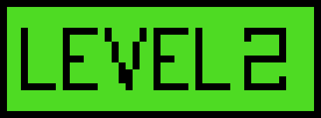
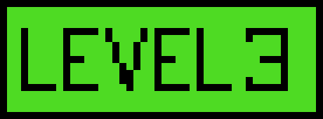

# Measures to improve your online privacy and security

<b>November 16, 2022</b>

In the past few years I've taken an interest in privacy/security. For many reasons, some due to the alarming levels of data collection we face from massive tech corporations like Google, Microsoft, Apple, Meta (formerly Facebook) or Amazon. Others due to the fact that I, like many other people, have had my (now deleted) Facebook account hacked once or twice in the past, maybe due to company negligence, like Facebook not securing their systems properly, or due to poor password management.

In this article I plan to explain some of the tools I've used to reduce such data collection as much as possible and within certain bounds. I want to do this in 3 levels, the lowest one being the weakest and with the most exposure to third party data collection, the next one with a bit more time investment but likely worth your time to greatly reduce such data collection, and the last one for those that are willing to actually spend hours to days to become as private and secure as they can, as well as some useful resources to go down the rabbit hole.

***

### Article index

  - [Why should I care?](#why-should-i-care)
  - [Are you affected by data collection?](#are-you-affected-by-data-collection)
  - [Privacy is a right](#privacy-is-a-right)
  - [Security is a must](#security-is-a-must)
  - [Measures and mitigations](#measures-and-mitigations)
    - [Basic security measures that apply to all levels](#basic-security-measures-that-apply-to-all-levels)
    - [Level 1: minimal measures](#level-1-minimal-measures)
    - [Level 2: strong measures](#level-2-strong-measures)
    - [Level 3: powerful measures](#level-3-powerful-measures)
  - [Conclusions](#conclusions)
  - [Additional resources](#additional-resources)
  - [Image sources](#image-sources)

***

## Why should I care?

Past generations, like my grandparents or to some extent even my own parents, never had to worry about data collection. There wasn't tons of storage to go around to store as much data as possible, there were little to no highly efficient and powerful tools for data analysis, there was no extremely granular and specific targeted advertising, and there were no meaningful data breaches.

My generation and the ones to come are going to live with this problem. We're going to have tons of sensitive data leaked onto random data dumps online. We're going to have tons of advertising companies, retailers, tech companies, governments and countless entities trying to gather as much information as they can about us, either for profit, surveillance or targeted advertising. Some are going to have their personal images, secrets and conversations leaked online or to other people's phones. And we're going to have to teach our kids or younger siblings about the importance of privacy and security.

***

## Are you affected by data collection?

Most people are only ever indirectly affected by massive data collection, so most people don't care about it. I've had countless friends and family members tell me directly that they don't care about data collection at all, some have even told me "let them gather all the data they want, i don't care". My understanding for this reasoning is that they potentially hold the following beliefs:

1. They believe it is inevitable

2. They consider that any meaningful data has already been collected

3. They have "nothing to hide"

*To which I would answer*:

1. It is, to an extent, you can mitigate a lot of it by using privacy-friendly software, avoiding products/software whose entire economic model is the sale of collected user data to third parties, living in a more privacy-friendly jurisdiction, etc... 

2. There is always more data to collect, you are constantly creating new data when sending new messages, using search engines, browsing to new websites, watching new Netflix shows, listening to new songs on Spotify, buying new things on Amazon, paying for items at some retail store with your card, making calls, posting pictures, liking pictures, tapping on an app to open it, etc... The extent of possible and effective data collection nowadays is greatly underestimated by users.

3. The most **terrible** reason ever. Data privacy is not only something people with "things to hide" want. Extreme edge cases: Would you want your parent's home address and how much their net worth is to be in the possession of some dangerous individuals? Would you want pictures of your naked body that you sent your ex-partner posted as the headline of some newspaper? Would you like to receive SMS messages daily with death threats because your phone number was leaked in some random database? then you have enough "things to hide" to care about data privacy. 

***

## Privacy is a right

The right to privacy is present in over 150 national constitutions. There are reasons governments used to at least pretend to care about it. In the past and at times in the present, governments or law enforcement would try to protect you against blatant violations of privacy. This notion somewhat changed when Edward Snowden revealed that the NSA and other government-owned intelligence agencies were spying on US citizens and essentially the entire world through backdoors, spyware and extensive surveillance campaigns.

Wikipedia has an [excellent article on the right to privacy](https://en.wikipedia.org/wiki/Right_to_privacy) that I highly recommend reading if you're interested in the right to privacy, its history and how it's evolved over time.

I firmly hold the belief that privacy is a right and should remain a right. We should push back on any blatant attempt at taking away any of our basic rights and our right to privacy should *not* be the exception to this rule. Neither governments nor companies should ever be allowed to blatantly violate our right to privacy. Plenty of people advocate for this, but it is slowly becoming less and less of a priority for people, it's become a 'given' that our privacy will be violated, especially our digital privacy.

Sadly, we only care about our rights when they're violated or taken away from us. Governments and large companies are working hard to extract as much value as they can, and as long as your personal data is valuable, your privacy is at risk.

***

## Security is a must

Your life is going to be increasingly digitalized, less pen and paper, less handwritten forms, less physical content consumed and more digital everything. Every single aspect of our lives is now digitalized for the sake of practicality, efficiency, order and predictability. Less people doing mundane tasks and more people doing complex tasks. Not just for the sake of privacy, but also for the sake of *predictability*. You don't want your day to be interrupted by a random account getting logged out because you used an easy password. You don't want your finances to be under threat because you were fooled by someone that seemed legit through a very sophisticated social engineering attack. You don't want your personal documents or family pictures to be in some random computer on the internet, in the possession of god knows who because some company you trusted used a knowingly weak piece of software to store them.

There are tools and good practices you can follow to avoid having personal data leaked, avoid getting hacked and have a more organized and secure digital life. You want to spend time doing *what you want to do* not having to run to fix some issue caused by a bad practice on your part, or by a bad practice from a third party company you entrusted with your data. Therefore you should strive to use services that respect your privacy and security, and where you're *a user of the product* and *you're not the product*.

Companies *don't care about your security* unless there's financial consequences for not protecting it. Usually, if you get hacked on an account with a short, predictable password, it's not the company's fault, so they won't always make sure your password is secure, it is **your job** to care about your security. Same applies to using sketchy services, random free VPNs or bad software.

***

## Measures and mitigations

Now that you hopefully care, let me give you 3 levels of privacy measures to take. Some basic security measures apply to all levels and are the only security recommendations I'll give. If  

### Basic security measures that apply to all levels

+ Get an independently audited password manager, I recommend [**Bitwarden**](https://bitwarden.com/). It's open source, independently audited and can even be self-hosted if you want to scale up to level 3. Some closed source options are excellent too, if you don't mind the extra cost and the fact that it's closed source, [**1Password**](https://1password.com/) is a commonly recommended great, trusted, independently audited and feature-rich option. Use a strong master password, don't make it easy or obvious, memorize it.

+ Uninstall any random anti-virus software and other useless software installed on your PC. The more apps you have the higher your surface area for attacks is.

+ Use secure passwords and try to use 2-factor or multi-factor authentication wherever possible. Try to avoid SMS 2FA, SMS is not especially secure and it opens you to the vulnerability of being SIM swapped if someone has already attained your credentials for whatever service you're using SMS 2FA on. Try to stick to mobile authenticators like Aegis, andOTP or those provided by a password manager like Bitwarden or 1Password.

+ Revoke inexplicable permissions on random apps, example: a tic tac toe app should have zero need to use your camera, precise geolocation, full access to storage or access to contacts.

### Level 1: minimal measures

This is the simplest set of measures I would recommend *everyone* to do in order to improve their online privacy and security.

+ **VPN**: Use a VPN *only when you need it*, do **NOT** use random free VPNs. If you need a free VPN you can use the free tier of [**ProtonVPN**](https://protonvpn.com/). VPNs can see all your traffic as they make DNS resolution for you, some VPNs promise NOT to log your traffic, few prove they don't log your traffic. Random free VPNs like HolaVPN or any other service like this is almost surely logging every single DNS request you make. If you want a paid VPN, [PrivacyGuides.org has a great page with some solid recommendations](https://www.privacyguides.org/vpn/), but if you don't want to visit, the recommendations are [**ProtonVPN**](https://protonvpn.com/), [**IVPN**](https://www.ivpn.net/) and [**Mullvad**](https://mullvad.net/).

+ **Web browser**: Do not use Google Chrome, switch to [**Brave**](https://brave.com/) or [**Firefox**](https://www.mozilla.org/en-US/firefox/new/?redirect_source=firefox-com). Google chrome is known for [significant tracking of its users](https://en.wikipedia.org/wiki/Google_Chrome#User_tracking_concerns). It is also closed source software, so you are very limited when it comes to determining what the software is doing at a low level. If you're on a mac and just use **Safari**, you can stick to it, but it's much better than Chrome. If you're on Windows, **Edge** is probably just as bad privacy-wise as Chrome, so I recommend switching to Brave or Firefox.

+ **Mobile phone**: iPhones are alright at privacy now, you almost only have to trust Apple with your data which is bad enough, but better than out-of-the-box android phones which are not as hardened and sandboxed. For android just go into settings and try to tick as many data collection options off as well as phone permissions on applications. iPhones are better out of the box in terms of privacy at the time of writing.

+ **Operating system and apps**: find the settings on your OS and applications that relate to telemetry, data collection, 'optional anonymized data sharing' or anything of the sort and just disable those settings. Always disable these settings whenever possible.

+ **Cookies**: whenever a site prompts a cookie banner, try to decline it and tick off as many options as possible. Most websites honor this selection of settings, some may not, but it can't hurt to keep it to 'only necessary cookies'.

+ **Social networks**: social networks also often have settings related to anonymous usage data sharing, always tick these off.

+ **Cloud storage**: for cloud storage just try to avoid services that don't do basic server-side encryption (even if they're the ones holding the encryption keys). Last time I researched it, OneDrive still didn't do server-side encryption, so avoid it. Also avoid [services which have suffered data breaches in the past](https://haveibeenpwned.com/PwnedWebsites), it's never especially encouraging to use a service that has _already lost customer data before_. Both iCloud and Dropbox have suffered data breaches in the past, though iCloud is highly integrated with Apple's hardware, so at this level I cannot recommend to get off of iCloud as that's probably a major hassle for iPhone users and probably belongs in a higher level.

### Level 2: strong measures

All the previous recommendations on level 1 apply here. Once those are applied, you can continue hardening your privacy. These measures might require meaningfully more time investment than those at level 1, they sure are a hassle, but at times, you'll only have to do work *once* here, after that, you're going to be totally fine and will never have to tinker with it ever again. I highly recommend these, they're sure to protect your privacy significantly more than those at level 1.

+ **VPN**: never use free VPNs. The rest of the recommendations from level 1 remain.

+ **Web browser**: Same recommendations as level 1 with some additions:
  + On *desktop*: I'd say stick to **Brave** or **Firefox** regardless of operating system. Also [apply PrivacyGuides.org's recommendations](https://www.privacyguides.org/desktop-browsers/#recommended-configuration) to steer clear of any telemetry from Brave or Mozilla. Install [**uBlock Origin**](https://github.com/gorhill/uBlock) regardless of what web browser you pick.

  + On *mobile*, if you're on iOS, **Safari** is fine. If you're on Android, there's many options but the ones I've seen recommended online the most are **Brave** or **Bromite**, though I think Brave is a better option as it stays up to date more consistently than Bromite. **Firefox** on Android is OK, but it's clear Chromium-based browsers play better with Android than others.

+ **Mobile phone**: iPhones are still totally fine at this level IMO. If you have an android phone then going for phones that just use _stock android_ or as closer to it as possible are the better option. You can optionally opt for the most secure android phones which are Google Pixels. Same recommendations as level 1 apply for android.

+ **Operating system and apps**: Same recommendations as level 1 + some additional options:
  + *Operating system*: I won't recommend switching to linux at this level, though if you're brave enough, go ahead, it's really not that difficult. Otherwise, stick to the recommendations on level 1 and consider that macOS is _probably_ a more private option than Windows at this point.

  + *Apps*: Avoid apps that are known to be telemetry-ridden and opt for open source options instead of closed source ones whenever you can. Some examples to this would be not using the Microsoft Office suite and using known privacy-friendly open source alternatives like Libreoffice. [AlternativeTo.net](https://alternativeto.net/) usually has good open source recommendations if you add `?license=opensource` at the end of a search query. Example: you need an alternative to photoshop that is free and open source, you can search `open source photoshop alternative` on a search engine and you'll find a link to `AlternativeTo.net` which will have this license query term at the end of the URL, in this case: `https://alternativeto.net/software/adobe-photoshop/?license=opensource` will be the URL. You can always just make searches like this on your chosen search engine and you'll get the result you're looking for from this site. 

+ **Search engine**: switching to a different search engine is usually a trivial endeavor for most web browsers, however, getting used to the features of a search engine like google and then switching can be somewhat difficult. Some privacy friendly search engines I can recommend are [**Startpage**](https://www.startpage.com/) which fetches the same results as google, [**DuckDuckGo**](https://duckduckgo.com/) which has lots of useful results and search engine instant answers like google, and [**Brave search**](https://search.brave.com/) which is also a pretty solid option. Most of these are also recommended by [PrivacyGuides.org](https://www.privacyguides.org/search-engines/?h=search+e). I personally like Startpage. For features like location-based restaurant recommendations, I do use Google maps without a google account personally, *but not google search*.

+ **Cookies**: *always* decline non-essential cookies, no matter how annoying it is. You only will have to do this once per website you visit if you get the banner prompt per device.

+ **Social networks**: avoid Facebook and Meta-owned platforms like Instagram if you can, otherwise just please for the love of everything that's good close your Facebook account if you don't use it and have the app on your phone. Delete the app after deleting the account if you end up doing so. If you barely use instagram and apps like these then just disable some of its permissions on your phone. Try to avoid google too if you can, they're both ad companies and as hungry for data as possible. They make money with your data.

+ **E-mail**: if you don't mind paying for your email (remember, when it's free, you're the product and your data *will be sold to third parties or used to train random ML models*), I can recommend [**ProtonMail**](https://proton.me/mail) or [**Mailbox.org**](https://mailbox.org/), both solid, privacy-friendly email providers with tons of features. [PrivacyGuides.org also has good recommendations](https://www.privacyguides.org/email/?h=email) for email providers. If you do, then it's OK, just don't do especially sensitive communication through free email providers like Google, Outlook or iCloud, they're fine feature-wise, but your emails will almost certainly be scanned and used to train ML models or sold in bulk with everyone else's data to third parties as well as used to target you with ads all over the web.

+ **Cloud storage**: I guess it's still OK to use iCloud here if you're an Apple user. For other purposes, just use something like [**Cryptee**](https://crypt.ee/) or [**ProtonDrive**](https://proton.me/drive).

+ **Instant messaging**: I know... no one else will switch yet, but just in case, get an alternative to a service like Messenger (Meta-owned) or Whatsapp (also Meta-owned). Meta-owned services are useful for messaging people because _everyone f*cking uses them_, I get it, but just get [**Signal**](https://signal.org/) if you can, just have it, we need to _onboard more people into privacy-respecting services_ that won't _data mine you every second of the day_, hopefully someday people understand the importance of this and by then you would already have a privacy-respecting app on your phone that you can use with those that start to become aware of their importance. Otherwise... ok, just use what everyone uses (for now). 

+ **SMS**: Do **NOT** use SMS, ever. Only iPhone users with iMessage should ever do this because iMessage is E2EE (end to end encrypted). For instant messaging, use what's recommended in the previous bullet point.

+ **Calling**: Avoid making calls through your mobile phone provider, try to always use encrypted VoIP calls, like through Signal or Whatsapp.
  
### Level 3: powerful measures

These measures are *serious*. If you do any of these things, your threat model is elaborate and complex, you understand the importance of your personal data, and more importantly you care to spend a significant amount of time trying to stop companies and government entities from gobbling up as much of your digital breadcrumb trail as possible. Nothing is perfect, you'll still have to make some compromises like using Whatsapp to talk to your family or whatever, but you know this is a compromise and not necessarily a reality that you forever have to accept.

+ **VPN**: Use one of the paid VPNs recommended in level 1 only, and use it whenever you're in a public Wi-Fi network (you might not be able to do so on planes though). If possible, also set up a self-hosted wireguard server at home to which you can connect using your client (phone/laptop). The self-hosted wireguard server will make more sense as you continue to read this section. Otherwise, a good, privacy-respecting paid VPN provider like those mentioned in level 1 are going to be more than enough for whenever you're out. You can also optionally use a VPN when connected to your cellular network, that way you don't have to rely on your ISP.

+ **DNS**: Use a private DNS resolver when possible or self-host a [pi-hole server](https://pi-hole.net/) with an [unbound recursive DNS server](https://docs.pi-hole.net/guides/dns/unbound/). For private DNS resolvers Android phones have this option under Settings -> Network and internet -> Private DNS. For iOS, [the Adguard site](https://adguard.com/en/blog/encrypted-dns-ios-14.html) has a good tutorial on how to do this. You can use any of the listed DNS resolvers in the [PrivacyGuides.org DNS resolver](https://www.privacyguides.org/dns/) recommendation page. This will allow you to block malicious links, ads, as well as most DNS requests to telemetry and data collection domains. This is also where the wireguard server at home fits in, if you have a wireguard server in the same machine, or another machine within the network that the pihole + unbound DNS servers are servicing, your wireguard connection will perform DNS resolution using them, thereby protecting you from another resolver logging your requests or a potentially compromised one.

+ **Web browser**: Same as level 2, but absolutely make sure that you [apply PrivacyGuides.org's recommendations](https://www.privacyguides.org/desktop-browsers/#recommended-configuration) for browsers. On Android stick to Brave, and on iPhones stick to Safari or Adguard browser. [PrivacyGuides.org](https://www.privacyguides.org/mobile-browsers) also has a good article on mobile browsers you should check out with some recommendations to be applied.

+ **Mobile phone**: iPhones could be OK depending on your personal threat model, are you comfortable with sending lots of data to Apple? if so, then it's fine. If you're still not comfortable with this, then the strongest bet is a Google Pixel with [**GrapheneOS**](https://grapheneos.org/), which you'll have to flash onto the device.

+ **Operating system and apps**: At this level, linux is pretty much the only option.
  + *Operating system*: Use a linux distribution. Almost any linux distribution is OK, though I like the options [recommended by PrivacyGuides.org as well](https://www.privacyguides.org/linux-desktop/), I personally think it's not that much of an issue to use a frozen distribution like Debian. I find the stability and predictability of this kind of distribution rather comfortable and have not had the best experience in the past with distributions like Ubuntu. Most distributions will be fine for almost everyone, though the ones I'd say will be closest to your experience with a non-linux OS (if you're coming from that) is probably going to be either **Fedora** or **Linux mint**. These distros are generally aimed at less experienced users and going to have much more compatibility with more common software when compared to others. Of the ones I mentioned, I'd probably personally pick [Linux Mint](https://linuxmint.com/) with XFCE. For laptop users, some manufacturers ship laptops with linux (Slimbook, Tuxedo, System76, etc...) or have laptops with excellent linux compatibility (Dell, Lenovo).

  + *Apps*: As much open source as possible. Same recommendation on how to find it as in level 2.

+ **Search engine**: Level 2 recommendations remain, though optionally self host a tool like a searX instance or something similar for added privacy.

+ **Social networks**: this really depends on your network and what your contacts use. I'd say be more strict about what I suggested on level 2, try to lean away from apps like instagram, twitter, discord, etc... and try federated options like pixelfed, mastodon, matrix, etc... respectively.

+ **E-mail**: No Gmail, no outlook, no iCloud mail, no yahoo mail or any of that. Traditional free email providers are untrustworthy when it comes to sensitive data. Use some of the options recommended by PrivacyGuides.org as mentioned in level 2. Additionally, use an email aliasing service like [**AnonAddy**](https://anonaddy.com/) or [**Simplelogin**](https://simplelogin.io/) to avoid giving out the same address to every service, this will help you simply disable whatever address ends up caught in a data breach (guaranteed some will), or in the hands of the wrong third party that whatever service you registered for decided to sell your address to (guaranteed some will). Simplelogin will play well with ProtonMail if you have a Proton account, as it is now a subsidiary of Proton.

+ **Cloud storage**: first option should be a self-hosted [Nextcloud](https://nextcloud.com/) server. Otherwise, same two options mentioned in level 2, but no iCloud.

+ **Instant messaging**: Incredibly difficult to get your contacts over, but if possible, [**Signal**](https://signal.org/), other than that, [PrivacyGuides.org](https://www.privacyguides.org/real-time-communication/) has some good suggestions, though I'd really stick to Signal if possible. Whatsapp is bad, but it's better than Telegram unless you're using secret chats, if so, then Telegram is better than Whatsapp. Only use these if you have to. I would avoid Messenger or Instagram for instant messaging, only use these if you absolutely have to but preferably avoid.

+ **Calling**: Exchange no personal information in ordinary, non E2EE VoIP calls.

+ **Payments**: avoid giving all your transaction information to the same provider. The likelihood of your data being leaked may be higher if you use several banks for example, but at the same time, your data won't be all centralized in one entity. Additionally, try to use crypto to pay for certain things, lots of online services now take it and could be a good privacy-friendly option for payments.

+ **Other services**: learn to self-host services at home in a simple, affordable home server (Intel NUC or similar machines), in order to avoid additional data tracking and data collection. Hosting a media server to download films is near-free and with basically no data collection compared to a service like Netflix.

***

## Conclusions

You don't need to do everything I recommend, in fact, you don't need to do *anything* I recommend, it all depends on your [threat model](https://en.wikipedia.org/wiki/Threat_model). Take measures to be comfortable, make sure you feel safe and private online to the extent that you want and respect the desire of others to be more or less private than you. One added benefit of taking some or any of these measures is an increased perception and feeling of order in your life, so if that's worth it to you, give it a chance.

***

## Additional resources

+ [PrivacyGuides.org](https://PrivacyGuides.org)

+ [Awesome privacy github repo](https://github.com/pluja/awesome-privacy)

***

## Image sources

All sources for externally obtained images, in order of appearance:

1. [Shrug](https://www.elevana.com/htcye-blogs/why-shrug-free-sorrys-are-important-even-for-world-champions)

2. [Data leak forum post](https://www.bleepingcomputer.com/news/security/hacker-selling-twitter-account-data-of-54-million-users-for-30k/)

3. [Guy using PC and being watched](https://www.thestatesman.com/opinion/privacy-in-the-digital-age-1502822444.html)

4. [Bad password](https://www.repairshopwebsites.com/bad-passwords-and-9-other-cyber-security-errors-to-avoid/)

5. [Level 1 image (edited)](http://pixelartmaker.com/art/506be14633f06ad)
   
6. [Level 2 image (edited)](http://pixelartmaker.com/art/a2728ed6a04260c)

7. [Level 3 image (edited)](http://pixelartmaker.com/art/85f1406a11b8087)
