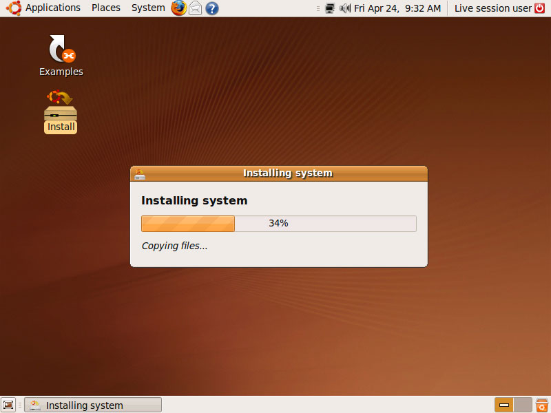
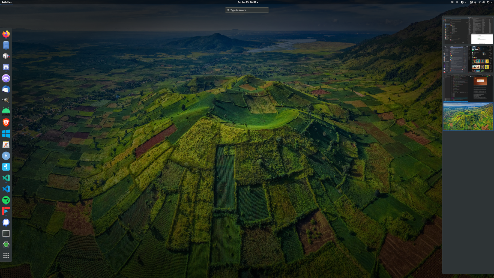

## My switch to linux as primary OS in 2020

<figure>
    
    <figcaption>The Linux mascot Tux.</figcaption>
</figure>

When the pandemic hit I was very lucky to be able to travel to start my master’s degree. It seemed impossible that I’d be able to go abroad, but whatever days those were, they pale in comparison to the status of the pandemic right now in Europe.

Back then I had built a new PC less than a few months prior, and decided to move with my grandparents to study from home (as all classes could optionally be taken online). Sold most of my gear before moving and set up here in a smaller desk, with only a single (but bigger and higher resolution) monitor than the dual monitor setup I had back in the Dominican Republic.

Then, about 3 weeks after moving, I had a working setup. However, Windows bored me a little bit.

I used linux extensively in the shape of Ubuntu 9.04 back when I was 14 in high school and my then laptop ran horribly with Windows Vista or even XP.

In the DR there’s a very traditional plate called “Mangú” (peeled, boiled and mashed plantains) which people usually accompany with fried eggs, fried salami, sautéed onion, fried cheese, avocado, or whatever they want!

<figure>
    
    <figcaption>The cozy Ubuntu Jaunty Jackalope install.</figcaption>
</figure>

Make no mistake, for a nerd like me, this was fun, REALLY fun, like going to disneyland at home. New shit to mess around with? sign me the f*ck up.

I immediately stumbled upon issues, I was a noob, I had no clue what I was doing and this linux thing was new to me. But I quickly got most things I needed running and had lots of fun with it.

I used it as my main OS for ~3 years, then moved to Windows 7 on a new mid-range laptop my parents got me for studying. The only reason I didn’t back to linux right away was the fact that I just needed things to work.

And, admittedly, this wasn’t the most user friendly thing in the world, so there were issues I’d eventually just give up on attempting to fix.

***

### So why would I bother trying it now?…

*Because it’s amazing.*

I got into data science after finishing my bachelor’s in the Dominican Republic, and as someone who very often spends time programming stuff (for personal use or for university), linux is literally the best thing ever.

Installing packages is a breeze, setting up a Python/R programming environment quickly is insanely easy and fast. My computer flies through tasks, the system is lightweight, private, secure and everything I need is here.

<figure>
    
    <figcaption>Simple, clean desktop.</figcaption>
</figure>

Every single problem I used to experience back in the day just doesn’t exist anymore, almost everything I’ve set to do or customize just works pretty much flawlessly.

<figure>
    
    <figcaption>The gnome 3 app switcher.</figcaption>
</figure>

I also keep another small SSD in my desktop with Windows 10 for the sole purpose of gaming when needed, as lots of games already run just as well and at times even better than on Windows.

I highly recommend trying it out in a virtual machine if you like tinkering, it’s fun to set up and to start over with it. It might just be the best tech/lifestyle decision I’ve made last year.

***

### Image sources (original unless cited)

1. [Unity Blog](https://blogs.unity3d.com/2019/05/30/announcing-the-unity-editor-for-linux/)
2. [HowtoForge.com](https://www.howtoforge.com/the-perfect-desktop-ubuntu-9.04)

***

**Date: January 23, 2021**
