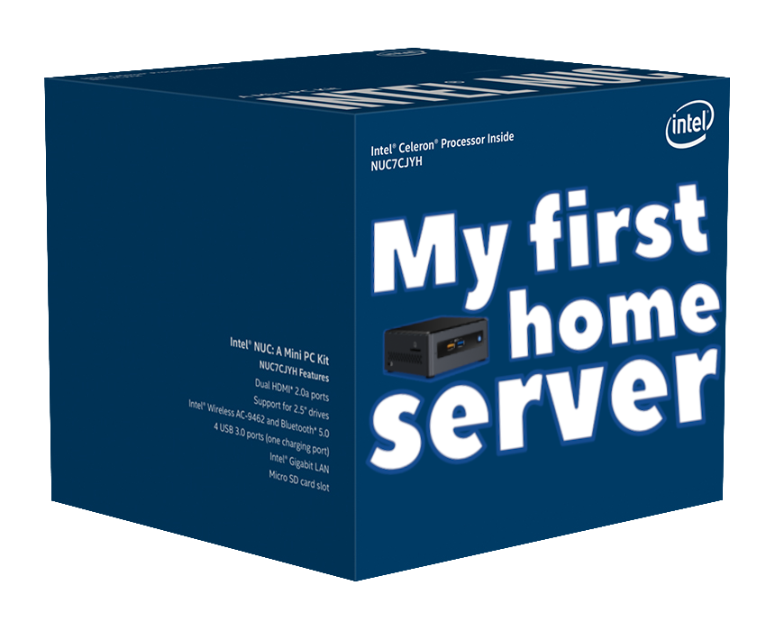
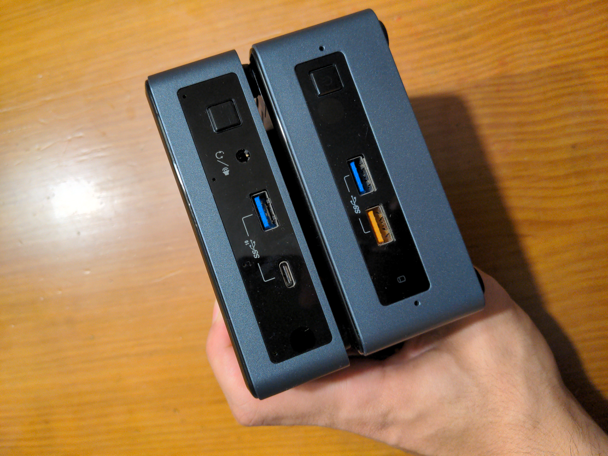
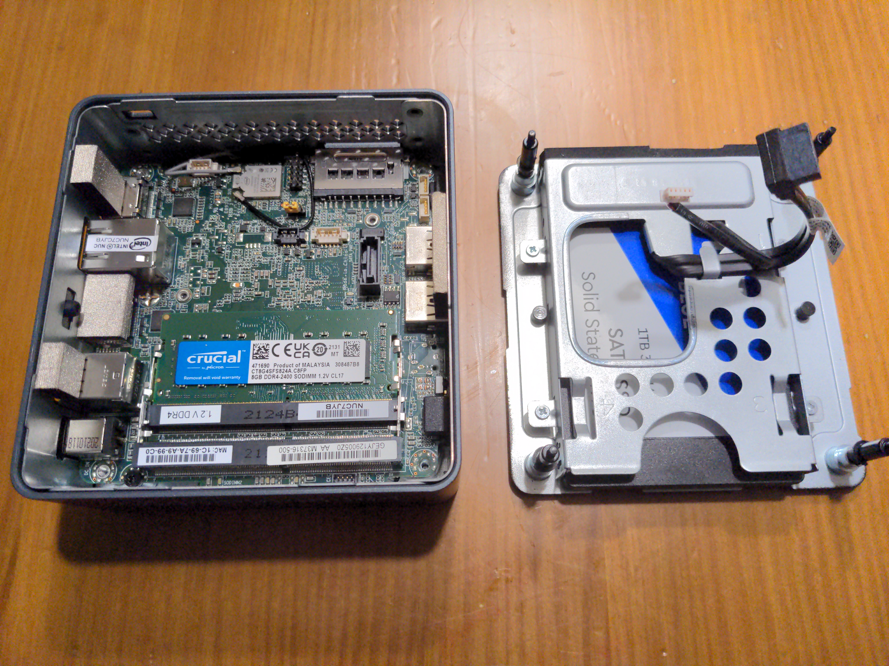
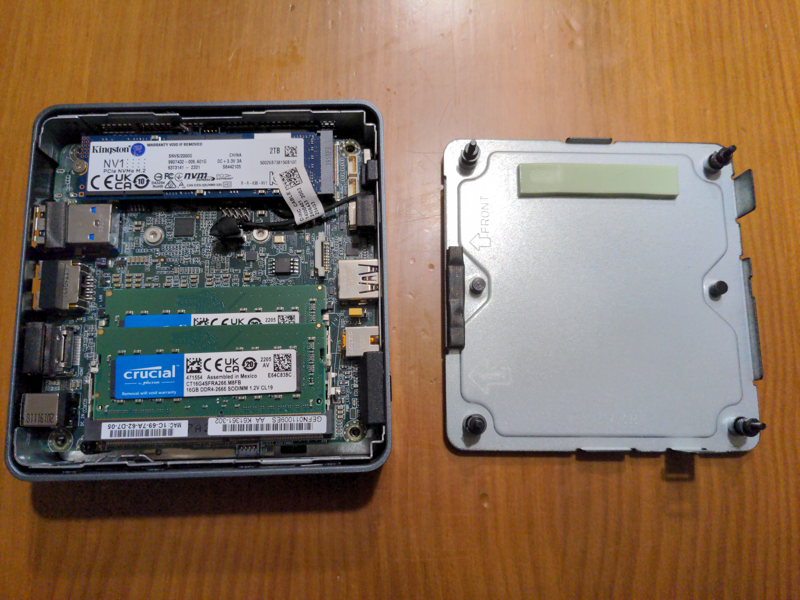
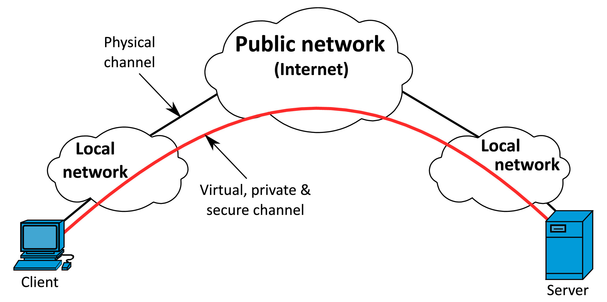
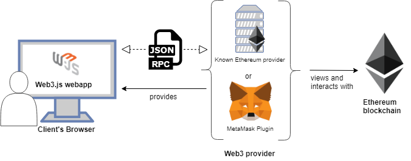
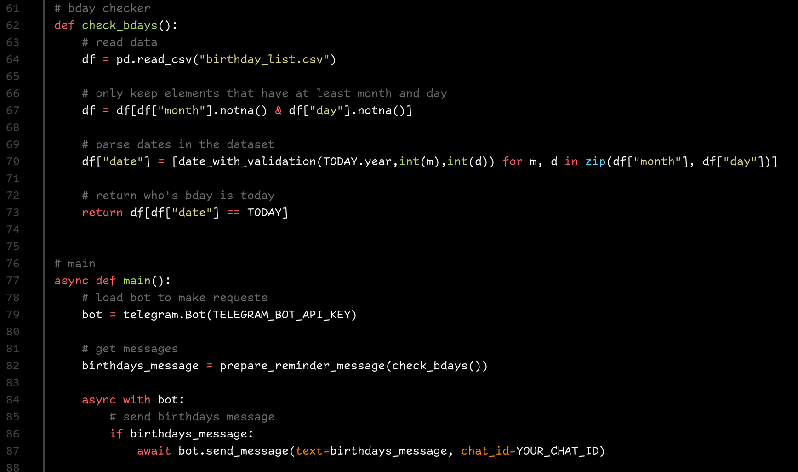

# My first home server

<b>Semptember 14, 2022</b>

When I voluntarily and temporarily got off the job market in mid late january - mid february this year, one of the objectives I had was to learn as much as possible in my time off. I now still have not returned to the market, but my time off has been used (in my humble opinion) rather effectively. One of the things I've been wanting to tinker with for the longest time is *servers*, specifically home servers and self-hosted applications.

My return to linux in late 2020 plus my strong interest in data privacy has made me increasingly interested in self-hosting services at home to break free from the shackles of closed source, proprietary services, as well as be able to automate simple tasks using simple scripts that require the always-on availability of a server to function effectively.

***

### Article index

  - [The machines](#the-machines)
    - [NUC-1 for self-hosted applications](#nuc-1-for-self-hosted-applications)
    - [NUC-2 for an ethereum full node (or validator, someday)](#nuc-2-for-an-ethereum-full-node-or-validator-someday)
  - [NUC-1: Main server](#nuc-1)
    - [The setup](#the-setup)
    - [Services it has replaced](#services-it-has-replaced)
  - [NUC-2: Ethereum node](#nuc-2)
  - [Conclusion](#conclusion)
  - [Image sources](#image-sources)

***

## The machines

<figcaption>Bottom is NUC-1, top is NUC-2. <i>Aren't they cute???</i></figcaption>

Both machines are Intel NUCs, hence the image at the top of the article. These are formidable little machines and I find them quite aesthetically pleasing as well, a perfect little squared box with rounded corners. These also have relatively low power consumption and are reasonably quiet.

### NUC-1 for self-hosted applications

Initially, I got a barebones Intel NUC NUC7CJYHN with a 2 GHz intel Celeron J4005 off of Amazon Spain and populated it with the following hardware:

- 16 GB Crucial DDR4 2400MHz CL17 RAM (Just added 8GB more but only one RAM stick is pictured)
- 1 TB WD Blue 2.5 inch SATA SSD

### NUC-2 for an ethereum full node (or validator, someday)

This second NUC I bought used off of a seller on Wallapop who initially advertised it as having an  i7-10510U but apparently (legitimately) didn't notice it was actually an i5-10210U. This was handled very well by the seller by giving me a meaningful discount on the item, as I noticed after receiving it. Maybe the dude was trying to scam me, but it seemed unlikely given how he handled it when I contacted him regarding the processor.

Anyway, I populated this NUC with much stronger specifications as I intended to run an Ethereum full node and these were the recommended specifications in most guides:

- 32 GB Crucial DDR4 2666MHz CL19 RAM
- 2 TB Kingston NVMe M.2 SSD

***

## NUC-1: Main server

The first machine I have been using for a very simple docker-based, self-hosted application machine. In particular, mostly as a Nextcloud server. Though I have a few little other applications, tasks and scripts running regularly here.

Setting up the machine to run such docker-based applications was surprisingly easy, though it's a lot to take in at first if you've never tinkered with networking or servers. There's quite a lot of things you have to have a reasonably acceptable understanding of when setting these up. I do not consider myself anything more than a noob that managed to get it running.

### The setup

I used a fairly easy to use and set up builder for docker-compose called [IOTstack](https://github.com/SensorsIot/IOTstack) aimed to be used on a raspberry pi. It's rather easy to set up and they also have an extremely helpful [discord community](https://discord.gg/ZpKHnks) which have gotten me out of trouble a few times.

The server is intended to be accessed through a Wireguard tunnel. Although it is perfectly possible to expose services on the web, I would rather simplify things and just use the Wireguard tunnel whenever I'm not home.

Not exposing services to the web has some benefits:

- Saves time, the setup is much more simple and has less of a learning curve
- It is not required to use or renew SSL certificates
- It is much less concerning from a security standpoint, as only clients holding authorized credentials can access the tunnel
- Connecting through a VPN already allows full access to the network, so the router can be rebooted, NUC-2 can be accessed, etc.
- VPNs are kinda cool

It connects fast and lets me manage the servers from anywhere, though given how common the local IP is in most households, I decided to change parts of my home router local IP to avoid clashing connections.

### Services it has replaced

+ **Cloud storage**: I used to use Onedrive, now I rely on a self-hosted [Nextcloud](https://nextcloud.com/) setup with periodic encrypted external backups to Onedrive and NUC-2. This means that in case of a house fire or both drives failing simultaneously (both NUC-1 and NUC-2's drive), I'd have to rely on a third party. However, this is not that bad, I'm not concerned from a privacy standpoint as the backups are encrypted (twice) and I find it extremely unlikely that Microsoft's data centers would fail exactly at the same time as both my drives would. I've also technically got a local backup of this on my laptop as well, with the most important files which are synced every day.
  

+ **Notetaking app**: I used to use Onenote, the note to self feature on Signal, or the Saved Messages feature on Telegram. I still use the last 2 but only for extremely quick notetaking. Serious, important notes and notes taken on meetings are all handled by [Joplin](https://joplinapp.org/), which I connect to my Nextcloud server and syncs all notes quite efficiently. I wanted a markdown-based tool and this one is perfect. An alternative I explored that didn't require self-hosting was Gitjournal, but that would mean I'm relying on a service like Github to host my notes, which could terminate my account at any time or (maybe?) snoop on my private repositories.
  

+ **Single-location VPN with an address that is not banned in range-wide VPN address bans**: Sometimes VPNs are banned on certain websites and it's extremely difficult to find a server that will actually show the website. If I were to need a fresh address, then I could just connect to my server and it'll basically show as if I'm where my server is. It is no replacement for an actual VPN, but it kinda does the job in some scenarios.

+ **Access to an Ethereum RPC provider**: As NUC-2 runs an Ethereum node, I can just use my private tunnel to my main server and use the tunnel to point `https://localhost:port` to that node using ssh after I'm connected through the wireguard tunnel. This increases privacy when interacting with the Ethereum network as well as reducing reliance on a 3rd party RPC provider. This is also a simple way to query mainnet data, as I no longer need to rely on ta 3rd party RPC provider.

+ **A place to periodically run useful scripts**: I actually didn't replace a service for this, but it does serve this purpose. In particular, I have at the moment two useful scripts I run every day in the server, one of them is a [birthday reminder script](https://github.com/dreth/BdayReminderBot) I made that sends me reminders for birthdays of people I care about to my telegram account through a telegram bot. Another one is [a script I made that reboots my home router](https://github.com/dreth/RouterRebootTool) every night by going through its web interface in a headless browser.

*** 

## NUC-2: Ethereum node

The second server runs an Ethereum full node, currently I'm using the two majority clients at the time of writing this (prysm+geth) as the node is not being used as a validator. I use this node to query blockchain data, to submit transactions or to just tinker with it. This one was a fun project to make, I might write about it in the future once I understand the CL and EL clients in depth.

***

## Conclusion

If you can and want to, run a home server, it's kinda fun, pretty useful and feels like a very organized and fun way to keep control of my data while also learning a thing or two.

I might update this article with anything new I install in it or any other services I replace with self-hosted applications.

***

## Image sources

Only adding sources for externally obtained images, in order:

5. [Nextcloud logo](https://commons.wikimedia.org/wiki/File:Nextcloud_Logo.svg)

6. [Joplin logo](https://en.wikipedia.org/wiki/File:Joplin-icon.svg)

7. [VPN diagram](https://www.atriainnovation.com/en/tutorial-to-create-your-own-vpn/)

8. [RPC provider diagram](https://ethereum.stackexchange.com/questions/93261/difference-between-metamask-and-ethereum-provider)

9. [Ethereum node image](https://ethereum.org/en/run-a-node/)
