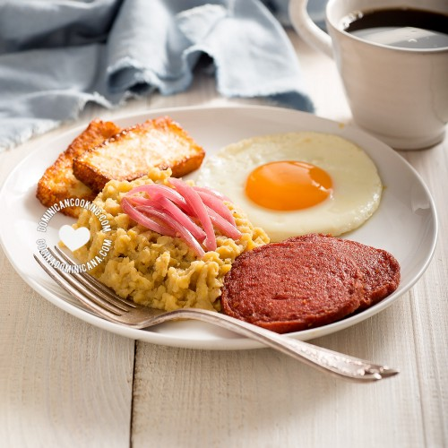

### How a staple of Dominican cuisine has helped me manage my Crohn’s Disease

I’m partly dominican and spanish. I grew up, went to school and did my bachelor’s in the Dominican Republic. My closest friends and parents live there and it has and will always have a special place in my heart.

Here in Spain, where I currently live, I still hold the common dominican practice of frequently eating plantains for breakfast or at any time.

<figure>
    
    <figcaption>Plantains being sold at a market. Source: <a href="https://en.wikipedia.org/wiki/Cooking_banana"> Wikipedia</a></figcaption>
</figure>

In the DR there’s a very traditional plate called “Mangú” (peeled, boiled and mashed plantains) which people usually accompany with fried eggs, fried salami, sautéed onion, fried cheese, avocado, or whatever they want!

<figure>
    
    <figcaption>Mangú topped with fried cheese and fried dominican salami. Source: <a href="https://en.wikipedia.org/wiki/Mang%C3%BA"> Wikipedia</a></figcaption>
</figure>

In my case, I do it a bit differently, as a person with IBD I can’t be eating fried things often or plates with too much fat in it. I usually eat it with turkey ham, a laughing cow cheese triangle and sautéed chopped onions. These sides make the plate flavourful (as plantains usually lack in flavour) and make it a very complete breakfast.

The too much fat problem may not be an issue for all people with IBD, but in my case, too much fat = a lot of time in the toilet agonizing.

Currently I’m in remission, however, throughout my crises, changes of meds, surgery, and all sorts of hurdles with my Crohn’s, this is the one thing I’ve always been eating for breakfast.

I’ve also changed it up sometimes, maybe I wouldn’t eat this every day, however it was a quite frequent dish that either me, my mom, my grandma, or Alba would prepare for me in case I had to go to class early, or to work while living with them and I thank them infinitely.

This dish always felt like something I had to keep eating, because for most people, eating this every day or as often as I did would be too much. It is commonly eaten in DR, but if you did so every day, you would barely ever go to the bathroom… unless you have IBD.

And while being a dish moderately high in fiber, along with other nice health benefits. Most people would have trouble doing number 2 if they ate it every day.

<figure>
    
    <a href="https://DominicanCooking.com"><figcaption>A very complete mangú plate. Source: DominicanCooking.com</figcaption></a>
</figure>

For me it was quite the opposite. I’d go to the toilet too much and this would make it easier to go by my day without having to worry about running to the bathroom in the middle of class or maybe before a work meeting.

Not to say meds didn’t help, totally the opposite. Meds have kept me healthy and alive, but I must say this has helped me control how often my body tells me to run now.

#### Further reading

Thanks for checking out my article!

**Want to prepare mangú at home or know more about its origins?**

- [Wikipedia Article on Mangú](https://en.wikipedia.org/wiki/Mang%C3%BA)
- Try out this recipe from [DominicanCooking.com](https://www.dominicancooking.com/532-mangu-mashed-plantains.html)
- [Tasty’s video on how to prepare it](https://www.youtube.com/watch?v=o0Irz2Bk_ik)