# Como invertir en bienes raíces utilizando RealT y blockchain

<b>October 13, 2020</b>

En un mundo increíblemente globalizado y cuya población se encuentra en constante crecimiento, la demanda de vivienda siempre se mantendrá vigente.

Siempre nos han dicho que invertir en bienes raíces es una excelente manera de acumular ingresos pasivos y que nos da la seguridad de ser un activo fijo cuyo valor generalmente tiende a subir.

Sin embargo, entrar en este mercado es (aparentemente) increíblemente complicado y de costos sumamente elevados. La gente dirá que si tienes bienes raíces es porque tienes mucho dinero.

La verdad es que no necesariamente gracias a la increíble innovación de empresas como [RealT](https://realt.co/ref/dreth/) y el poder del blockchain.

***

### Secciones del artículo

  - [Algunos detalles importantes](#algunos-detalles-importantes)
  - [¿Cómo RealT logra esto?](#cómo-realt-logra-esto)
  - [¿Cómo obtengo una cartera/dirección en el blockchain?](#cómo-obtengo-una-carteradirección-en-el-blockchain)
  - [Registrarse en RealT](#registrarse-en-realt)
  - [Comprar tu primer token](#comprar-tu-primer-token)
  - [Envío y recepción de Tokens y renta](#envío-y-recepción-de-tokens-y-renta)
  - [Monitorear la inversión](#monitorear-la-inversión)

***

### Algunos detalles importantes

Para invertir en las propiedades ofrecidas por RealT, necesitamos saber unas cuantas cosas:

- Las inversiones pueden ser desde 45–60 USD hasta miles de dólares (USD).
- Las propiedades a comprar o a invertir se encuentran localizadas en Estados Unidos y algunas son tipo Section 8 (Es un tipo de propiedad cuya renta es parcial o totalmente pagada por el gobierno de Estados Unidos, es decir, son viviendas cuya renta es subsidiada).
- Los pagos de la renta se pagan en una criptomoneda estable llamada USDC cuyo valor siempre equivale a 1 USD.
- Los pagos se realizan semanalmente (bajo el esquema actual dado a los elevados costos de transactar en el blockchain, sin embargo, hay planes futuros para volver a un esquema de pago de renta diario, como era inicialmente)
- Dado a que la inversión es un proceso legalmente avalado, deberemos firmar contratos digitales con nuestra identidad atada a ellos.
- Las casas están aseguradas en su totalidad y llevan junto con las mismas, una reserva que constituye RealT para mejoras y arreglos de averías.
- En cualquier momento podemos vender los tokens comprados de vuelta a RealT con únicamente un costo de procesamiento de pagos de un 1.5% ya que los tokens serán publicados nuevamente para que nuevos compradores inviertan.

***

### ¿Cómo RealT logra esto?

El proceso que sigue RealT para lograr internacionalizar inversiones de bienes raíces en Estados Unidos no es particularmente complicado de entender:

- El equipo evalua viviendas de ciudades en Estados Unidos y selecciona cuidadosamente las que considera más apropiadas (viviendas que sean tipo Section 8, es decir subsidiadas, o no subsidiadas en zonas de alto crecimiento y urbanización)

- La propiedad es el único activo de una entidad tipo [LLC](https://en.wikipedia.org/wiki/Limited_liability_company). Dado a que es su único activo, las acciones de dicha compañía constituída únicamente para la venta conjunta de la propiedad representan la propiedad en sí. Por lo que al comprar una acción (fragmento de el LLC) estamos comprando un “fragmento” de la propiedad y seríamos dueños de dicha propiedad en conjunto con otros dueños alrededor de todo el mundo.

- Se emite un token en el blockchain de Ethereum ([ejemplo](https://etherscan.io/token/0x87645f94f6EA37f9f2f56d4521315E9C1ed89aa4)), cuya cantidad de copias existentes coincide con la cantidad de acciones emitidas del LLC.

- El token se vende en la [página web de RealT](https://realt.co/ref/dreth/), se establece una fecha y se notifica en las redes sociales de realt (telegram, twitter, discord, etc…).

- RealT envía el contrato legal que representa dicha accion del LLC con todos los documentos relacionados con la pertenencia de dicha propiedad y la cantidad de acciones de la que RealT entrega a la contraparte del contrato (el inversionista).

- Luego de que ambas contrapartes firman el contrato (el inversionista y RealT), el token es enviado a la cartera de el inversionista en el blockchain (más adelante detallaré más acerca de como obtener una, utilizarla, etc)

- RealT cobra la renta de la propiedad con la regularidad establecida (una vez al mes) y deposita los USD y los tokeniza a través de la entidad que ellos prefieren ([Centre](https://www.centre.io/), por ejemplo, es quien emite los USDC y es una empresa subsidiaria de [Coinbase](https://www.coinbase.com) y [Circle](https://circle.com/), permite la conversión 1:1 de USD a USDC).

- RealT distribuye la renta a todos los dueños de los tokens (acciones) de dicha propiedad, quienes recibirán la cantidad de USDC correspondiente con su cantidad de tokens entre la cantidad de tokens total.
- Por ejemplo: 1- He comprado 1 token de la casa 10974 Worden Street, Detroit, MI 48224, el token tiene un valor de 53.59 USD de los 69,667 USD que vale la casa completa, por lo que soy dueño de 1/1300 del valor de la casa y por ende me tocaría ~0.077% de la renta de la casa, es decir, ~0.515 USD mensuales de renta, una tasa efectiva de ~11.52% anual.

***

### ¿Cómo obtengo una cartera/dirección en el blockchain?

Lo primero es tener una wallet en el blockchain de Ethereum o xDai. Mi cartera de elección para interactuar con aplicaciones en el blockchain y manejar mis criptomonedas es Metamask. Esto es muy sencillo y los llevaré paso a paso a continuación:

- Primero descargamos la extensión de Metamask para el navegador que usemos:

<figure>
    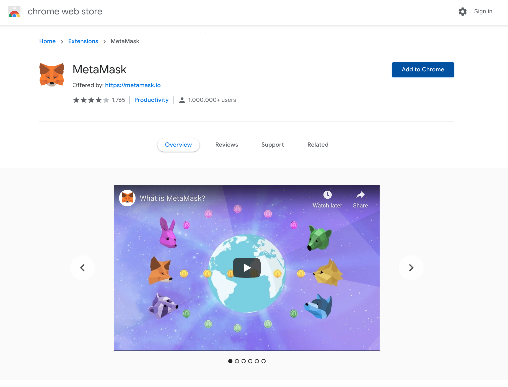
    <figcaption>Página web de la chrome webstore para la extensión de metamask para navegadores basados en chromium (chrome, edge, brave, etc.). También está disponible para Firefox.</figcaption>
</figure>

- Confirmamos que sí queremos agregar la extensión

<figure>
    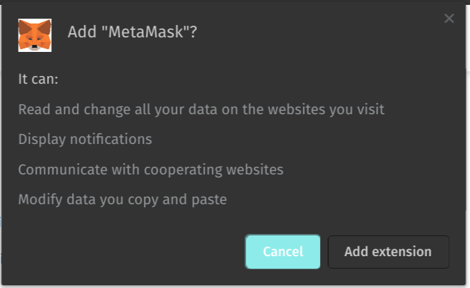
    <figcaption>Confirmación al agregar la extensión</figcaption>
</figure>

- Seguimos el proceso en Metamask para obtener un seed y un conjunto de direcciones asociados al mismo.

<figure>
    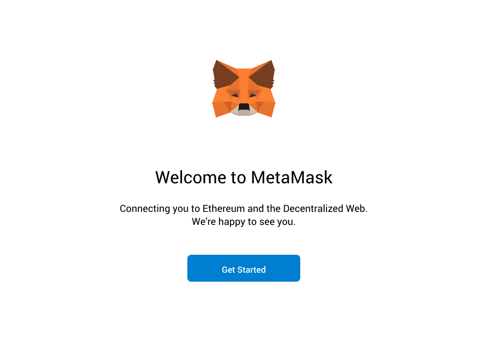
    <figcaption>Página de inicio de metamask</figcaption>
</figure>

- Presionamos en crear una cartera (o create a wallet en inglés), a la derecha.

<figure>
    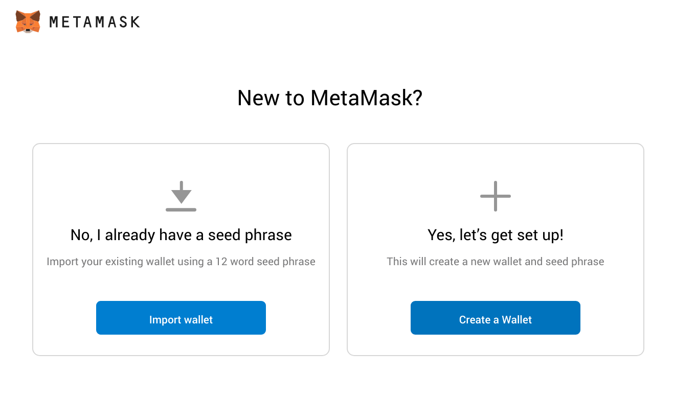
    <figcaption>Presionamos a la derecha para crear una cartera.</figcaption>
</figure>

- Damos o no damos consentimiento de uso de datos, yo generalmente prefiero decir que no a estas cuestiones en la mayoría de las aplicaciones. A pesar de que metamask es seguro, esto es preferencia personal.

<figure>
    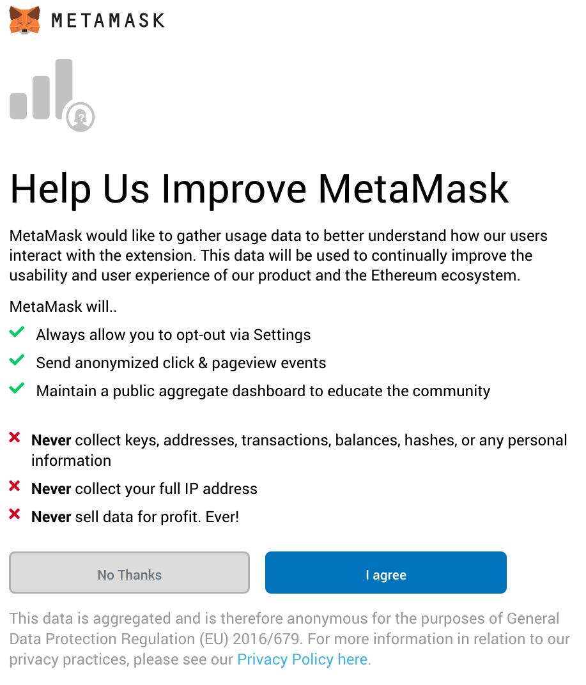
    <figcaption>Pantalla de consentimiento de uso de datos para fines diagnósticos.</figcaption>
</figure>

- Creamos una contraseña segura para esta cartera. **Importante: Esta contraseña está únicamente asociada al navegador actual donde se instala metamask, si usted restaura su seed phrase en OTRO navegador luego (o en el mismo si reinstala metamask), se le pedirá crear una clave nueva.**

- Asegúrese de crear una clave segura, ya que **cualquiera que tenga acceso a este navegador y a esta clave puede confirmar transacciones.**

- Es muy importante notar que al igual que sus claves de banco, de redes sociales, y todo servicio atado a una o varias contraseñas, **usted es responsable de sus contraseñas y de su seguridad.**

<figure>
    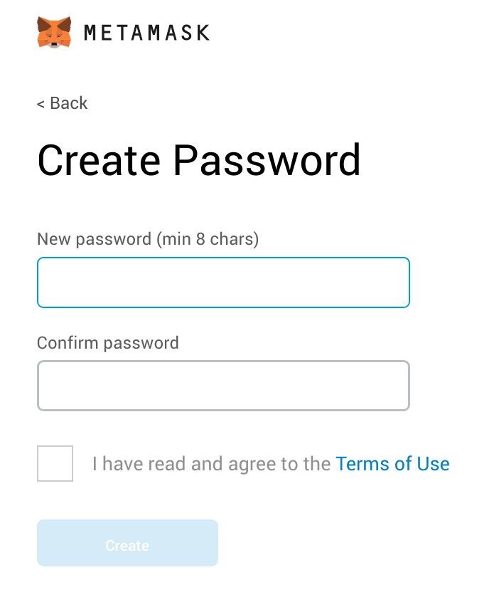
    <figcaption>Creamos la contraseña para metamask en este navegador.</figcaption>
</figure>

- El secret backup phrase/seed phrase o mnemonic **phrase es lo más importante de su cartera/dirección.**
- Esta clave está asociada a sus carteras/direcciones es decir, con estas 12 palabras se puede restaurar su cartera en **cualquier navegador o cartera.**
- Mantenga esto en un lugar **muy seguro, perder esto es como perder las claves de su banco y con eso tener acceso a todos sus fondos.**

<figure>
    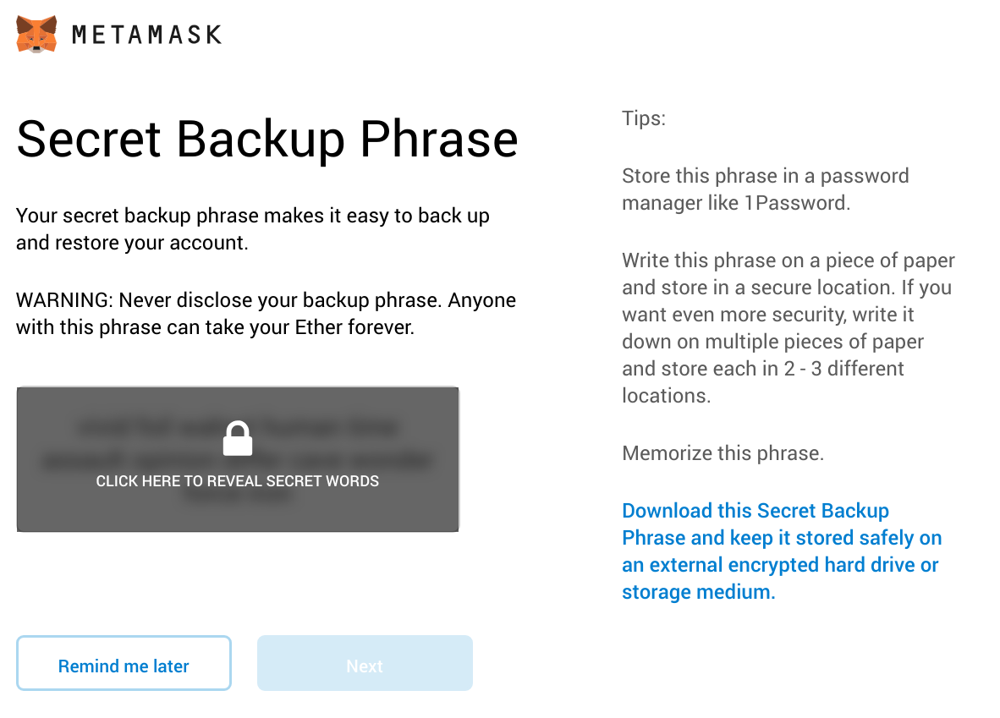
    <figcaption>Revelamos las palabras y las guardamos en un lugar MUY seguro.</figcaption>
</figure>

- Confirmamos nuestras 12 palabras luego de haberlas guardado.

<figure>
    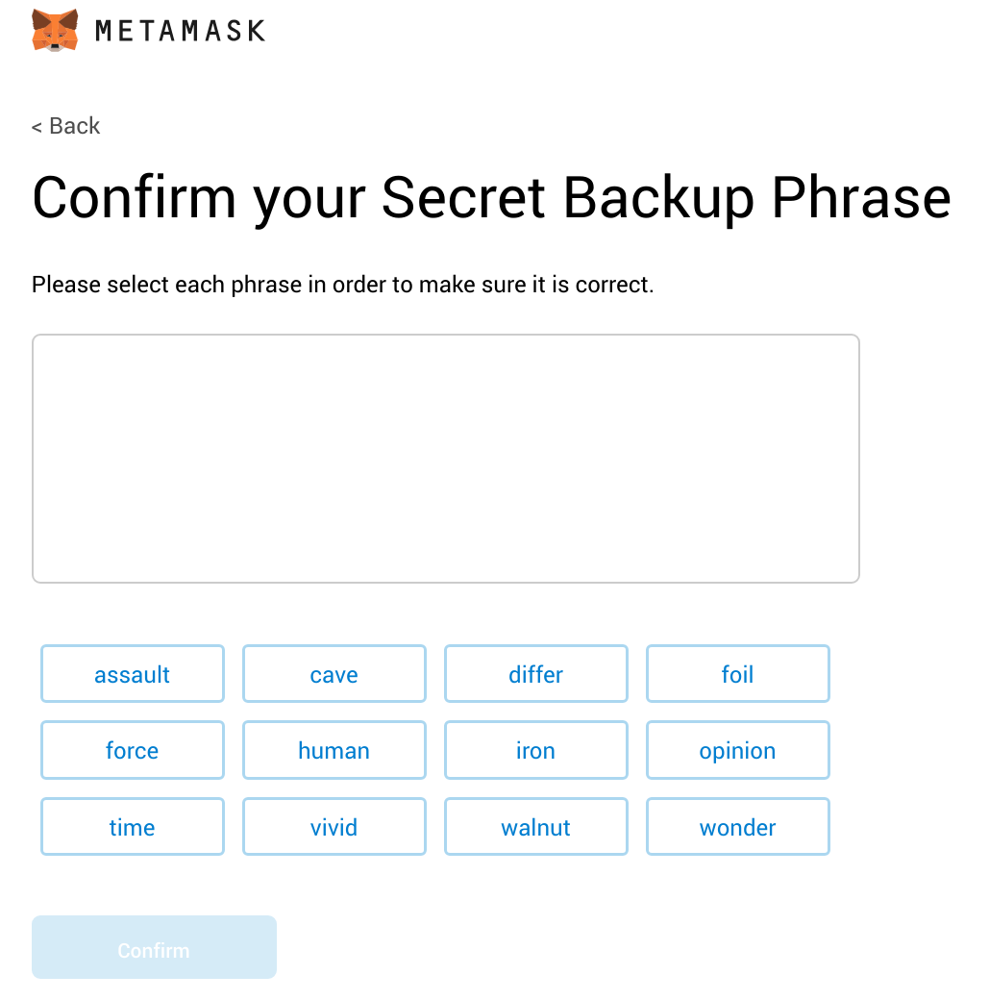
    <figcaption>Pantalla de confirmación para las 12 palabras.</figcaption>
</figure>

- Confirmamos en la pantalla siguiente y tenemos acceso a nuestra cartera de Ethereum (o xDai luego de [agregar el RPC de xDai](https://www.xdaichain.com/for-users/wallets/metamask/metamask-setup))
  
<figure>
    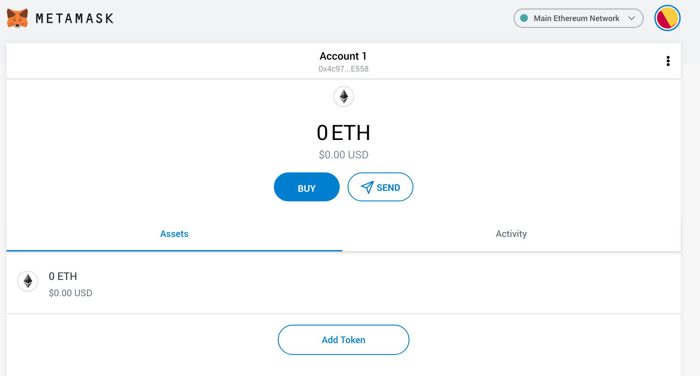
    <figcaption>Pantalla principal del wallet.</figcaption>
</figure>

- Una importante distinción que debemos hacer es que la cartera es de Ethereum y no de ETH (únicamente), es decir, en esta dirección podemos recibir ETH, pero también podemos recibir tokens que cumplan con el estándar ERC20.
- Para los fines de invertir en RealT, únicamente tendremos que estar familiarizados con los tokens que emite RealT y con USDC. Éstos cumplen el estándar ERC20 y son transactables de cartera a cartera de la misma manera que transactaríamos con ETH.
- Sin embargo, todas las transacciones que queramos emitir cuestan ETH, por lo que para mover los fondos de nuestra cartera necesitamos ETH.

Luego de tener la cartera creada y nuestras claves seguras, lo que debemos hacer es copiar la dirección de nuestra cartera y guardarla para cuando nos registremos en RealT para recibir los tokens y la renta.

- Copiamos la direción haciendo click donde dice “Account 1” de la manera siguiente.

<figure>
    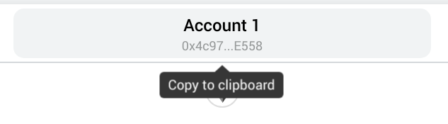
    <figcaption>Copiamos la dirección.</figcaption>
</figure>

Para los fines de este tutorial, la dirección que hemos copiado es la siguiente:

> 0x4c97900a0aC439ace9e9e4002b5c89DD543dE558

***

### Registrarse en RealT

La parte más sencilla del proceso, registrarse en RealT es como registrarse en cualquier otra página web, especialmente aquellas que requieren verificación de identidad, como lo es en este caso.

- Entrar a la página de [RealT](https://realt.co/ref/dreth)

<figure>
    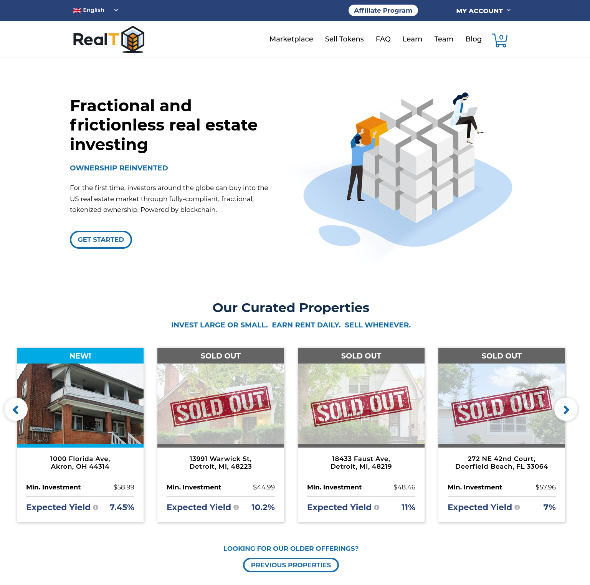
    <figcaption>En la página principal vemos las ofertas de propiedades ofrecidas por RealT.</figcaption>
</figure>

- La página también está disponible en Español, sin embargo, seguiré el proceso utilizando la página en inglés para ser consistente con el tutorial de Metamask.

- Sin embargo, no todos los elementos y descripciones de la web están traducidas.

<figure>
    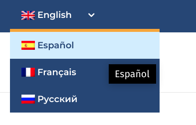
    <figcaption>La página también es ofrecida en Español.</figcaption>
</figure>

- Presionamos en Sign in

<figure>
    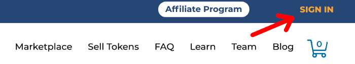
    <figcaption>Presionamos en Sign in.</figcaption>
</figure>

- Rellenamos el formulario de registro

<figure>
    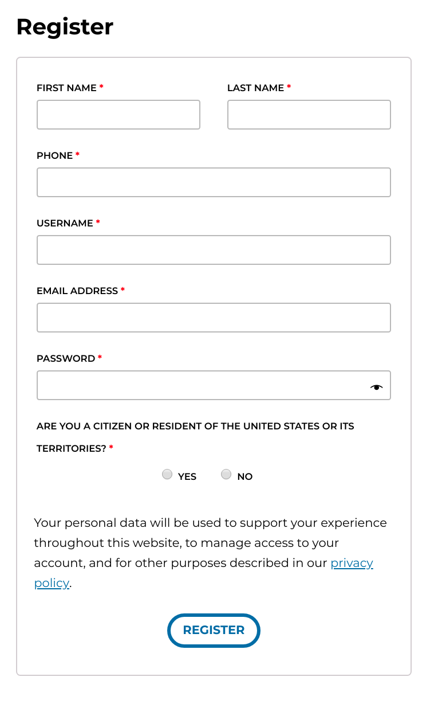
    <figcaption>Formulario básico de registro.</figcaption>
</figure>

- Luego de registrarnos, tenemos que completar el proceso de verificación de identidad dado que los contratos que firmaríamos al comprar parte de una propiedad son contratos que van a nuestro nombre.

<figure>
    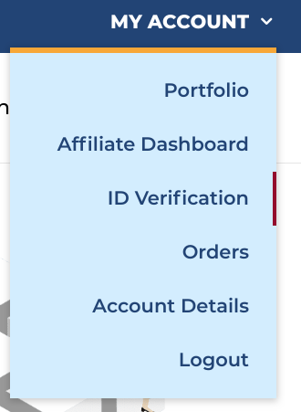
    <figcaption>Menu principal de cuenta y botón cde verificación de identidad.</figcaption>
</figure>

- Completamos la verificación de identidad y enviamos la información.
- El proceso de verificación debería tomar alrededor de 20 minutos, pero podría demorarse más o menos.

<figure>
    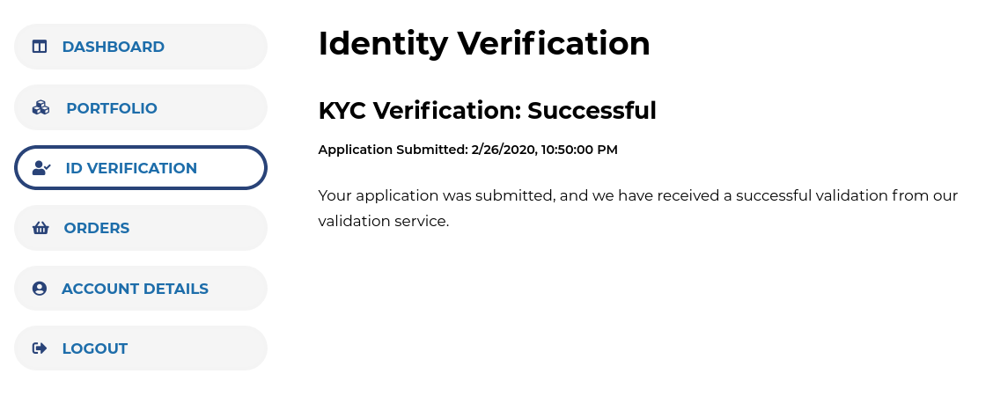
    <figcaption>Menú de verificación de identidad.</figcaption>
</figure>

- **La verificación de identidad no es necesaria para hacer una orden, sin embargo, para firmar los documentos y recibir los tokens en la cartera es necesario completarla.**

Luego de la verificación de identidad y tener la cuenta lista, podemos proceder a comprar.

***

### Comprar tu primer token

Para proceder a hacer una orden, las compras son muy similares a las de otras páginas web, sin embargo, tenemos un par de pasos extras muy simples.

- Primero vemos las ofertas o oferta que haya en la web en el momento de hacer una compra.

<figure>
    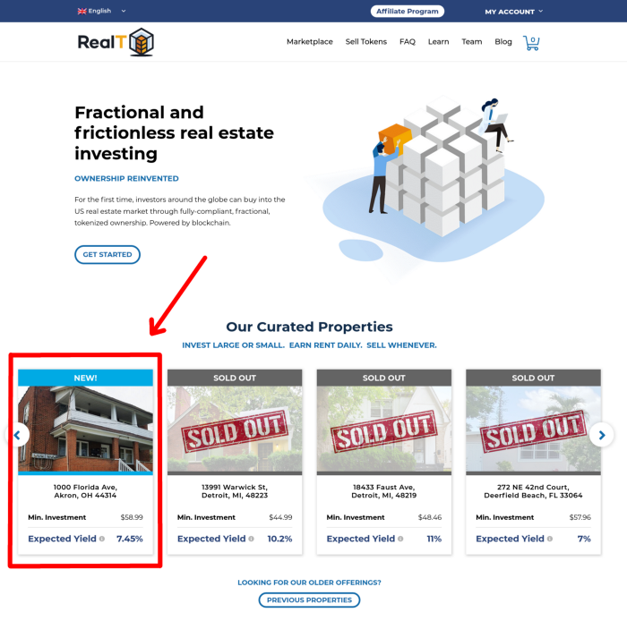
    <figcaption>Hay una propiedad disponible!</figcaption>
</figure>

- Toda la información necesaria de la propiedad se encuentra en la web de RealT, pero razonablemente, invertir en una propiedad viene con DYOR (Do your own research), asegúrese que esta propiedad se alinea con su apetito de riesgo y le gusta para hacer su inversión.
- Hay muchos tipos de viviendas ofrecidas por RealT, desde casas sencillas de 1 familia, propiedades rentadas bajo la categorización de Section 8, propiedades rentadas a residentes sin categorización de Section 8, propiedades multifamilia, etc.
- Esta propiedad específica ofrece las siguientes especificaciones:

<figure>
    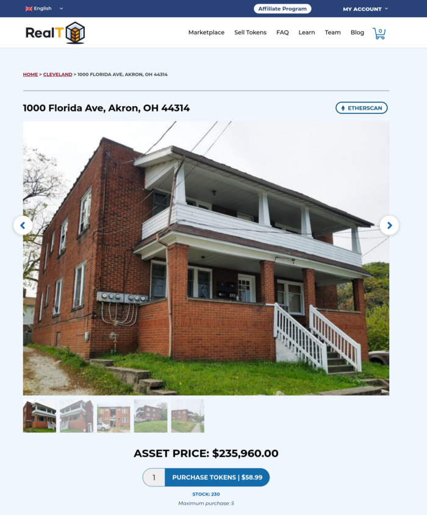
    <figcaption>Podemos ver fotos de la propiedad y la cantidad de tokens disponibles en ese dado momento.</figcaption>
</figure>

<figure>
    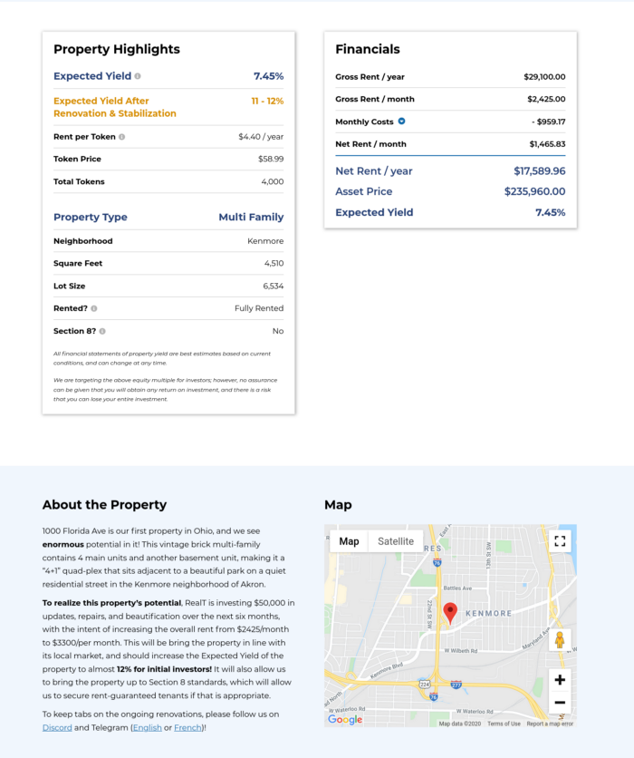
    <figcaption>Aquí podemos ver el valor de la propiedad, la renta a recibir, la ganancia anual a recibir, si la propiedad se encuentra en remodelación, localización, costos, etc…</figcaption>
</figure>

- Si usted decide que esta propiedad le agrada para invertir en ella, presione el botón comprar tokens.

<figure>
    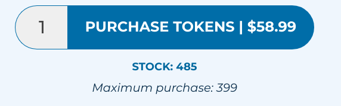
    <figcaption>Vemos que hay una cantidad máxima admitida de compra y podemos elegir cuantos tokens queremos comprar de la siguiente propiedad</figcaption>
</figure>

- Un detalle importante es que la demanda por las propiedades ofrecidas por RealT ha estado en un incremento continuo, por lo que hay mucho flujo de compradores al momento de publicar una propiedad en venta y RealT ha estado experimentando haciendo 2–3 rondas de venta por propiedad.
- Existe una limitación máxima de tokens por inversionista, de manera que nadie pueda acaparar todos los tokens de una propiedad y más personas tengan la oportunidad de invertir aunque sea lo mínimo posible (en este caso 58.99 USD).
- Luego de presionar el botón, podemos ver la cantidad de tokens a ordenar en el carrito.

<figure>
    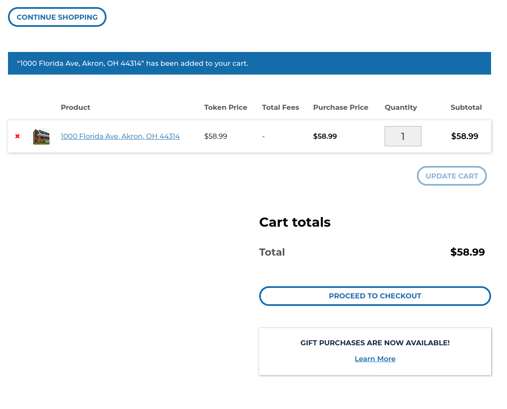
    <figcaption>Vemos el costo total de la compra</figcaption>
</figure>

- Procedemos al checkout y vemos las opciones de pago.
- Podemos pagar con tarjeta de crédito o débito o con criptomonedas usando Coinbase o Utrust.

<figure>
    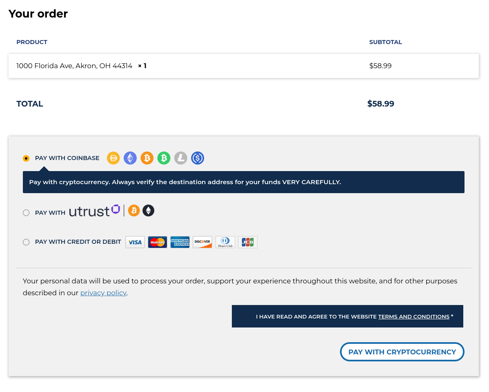
    <figcaption>Opción de pago a través de Coinbase y Utrust</figcaption>
</figure>

<figure>
    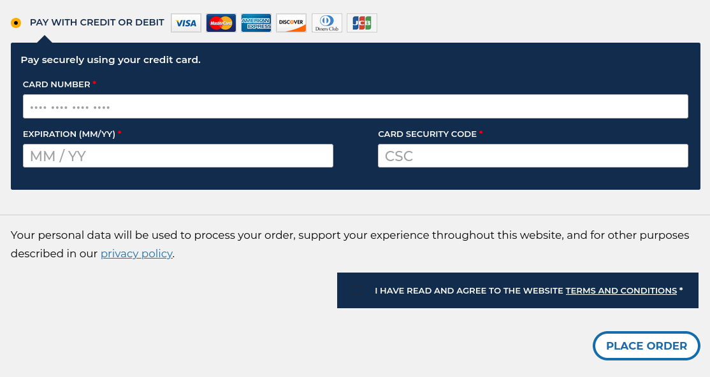
    <figcaption>Opción de pago con tarjeta de crédito o débito</figcaption>
</figure>

- Luego de proceder y aceptar los términos y condiciones y hacer la orden, nos llevará a la pantalla de confirmación de orden.

<figure>
    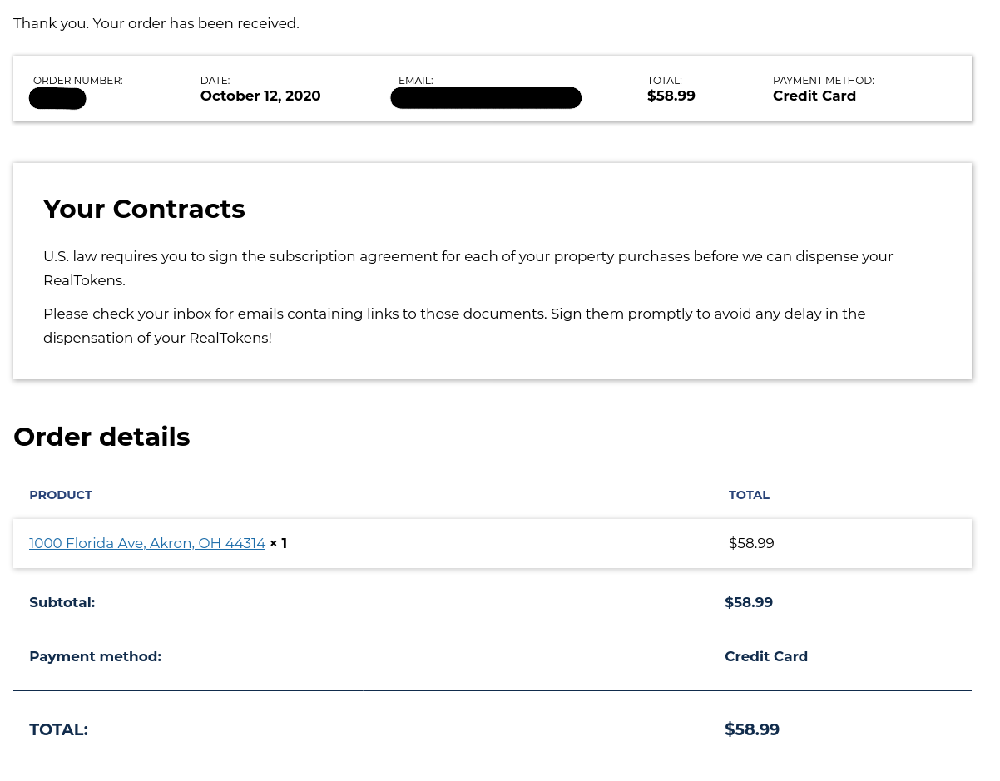
    <figcaption>Detalles de la orden y información acerca de los contratos</figcaption>
</figure>

- Recibiremos un correo de RealT con la información de la orden y otro con los contratos a firmar

<figure>
    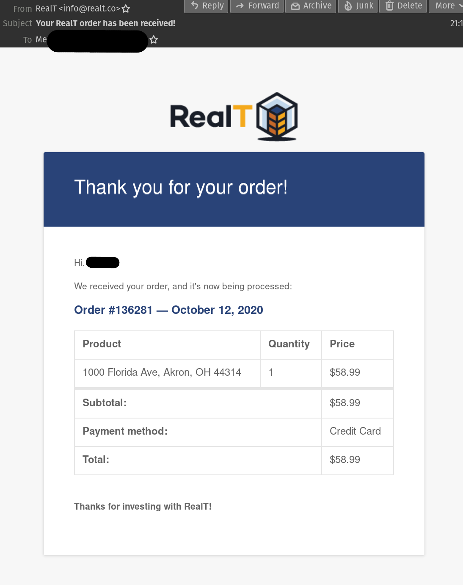
    <figcaption>Correo con la confirmación de la orden</figcaption>
</figure>

- Presionamos Review & Sign para firmar los contratos de la compra

<figure>
    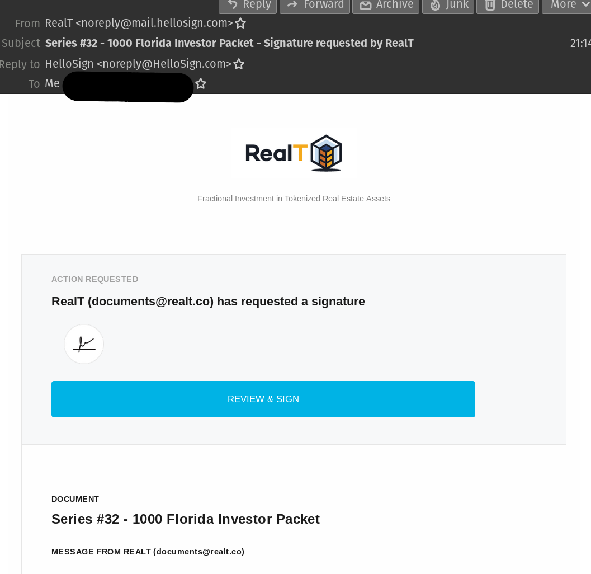
    <figcaption>Presionamos Review & Sign</figcaption>
</figure>

- Este enlace nos llevará a una página de HelloSign donde debemos marcar tres checks y firmar con una firma que HelloSign nos provee donde debemos poner nuestro nombre.
- Primero presionamos Get Started para comenzar el proceso de firma

<figure>
    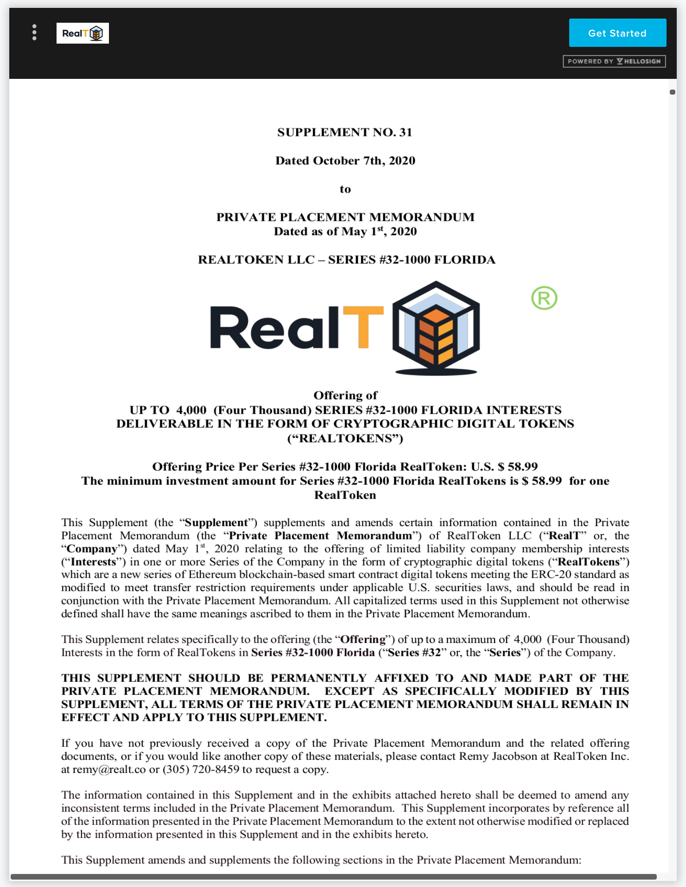
    <figcaption>Contrato para la propiedad de la cual hemos comprado 1 token</figcaption>
</figure>

- Luego de presionar en Get Started la página nos llevará automáticamente a los campos que tenemos que firmar.
- Siéntase libre de leer el contrato si así lo desea.

<figure>
    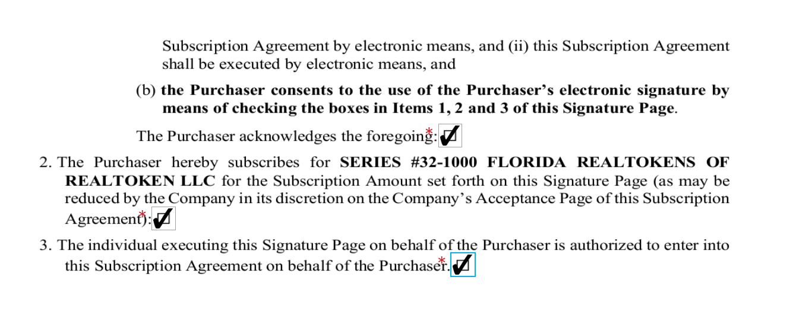
    <figcaption>Los 3 checks que debemos tener marcados y a los cuales HelloSign nos lleva automáticamente al presionar el botón azul</figcaption>
</figure>

- Finalmente, firmamos al final del contrato.
- Si es la primera vez creando una firma, únicamente debe poner su nombre, elegir un tipo de letra y presionar en insertar firma, de esta manera dejamos el contrato firmado bajo nuestro nombre.

<figure>
    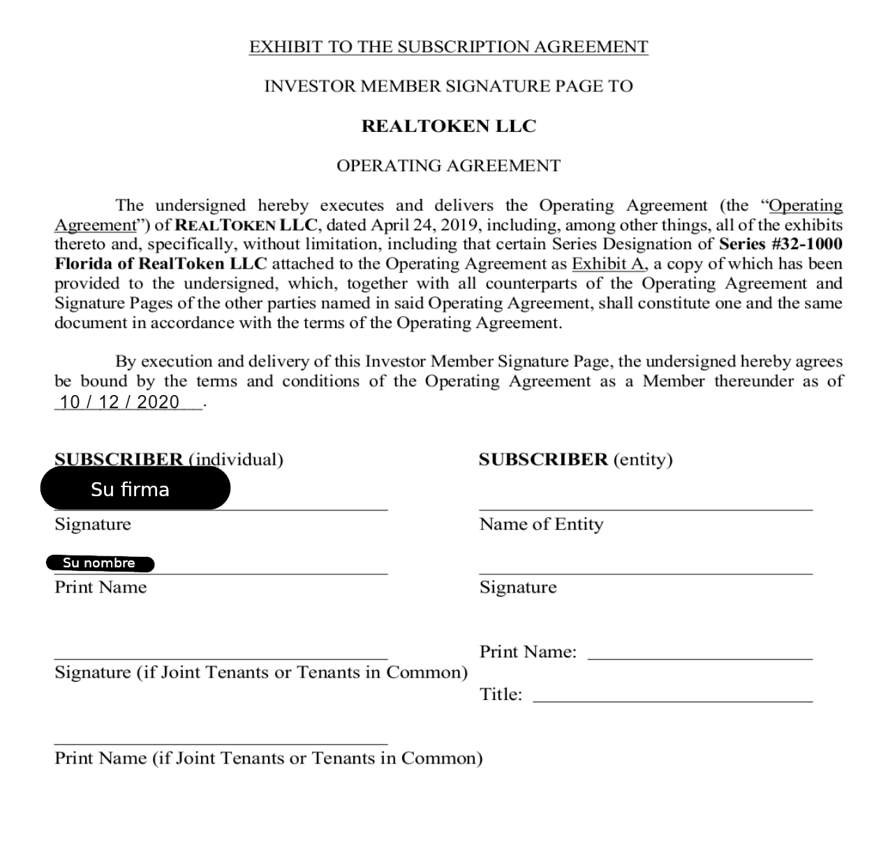
    <figcaption>La firma se inserta debajo de SUBSCRIBER (individual), el otro campo de print name dirá su nombre ya insertado</figcaption>
</figure>

- Luego de esto, presionamos en el botón azul que dirá Agree
- Al finalizar el proceso recibiremos una confirmación de RealT

<figure>
    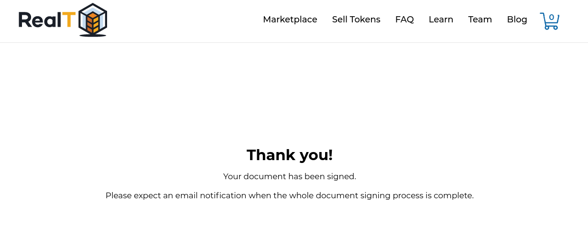
    <figcaption>Confirmación de firma</figcaption>
</figure>

- Luego de esto, RealT procederá a rellenar los campos que le corresponden como contraparte del contrato y al cabo de ~24 horas o menos, recibirá el token en su cartera y la renta correspondiente el Lunes próximo a recibir el token. Anteriormente el proceso de pago de renta se hacía los Miércoles.
- Dado a que RealT evoluciona constantemente, al momento de leer este artículo la fecha o frecuencia de pagos de renta podría cambiar, siempre con el propósito de beneficiar al cliente y para evitar costos innecesarios de transacción, ya que a RealT le cuesta enviar estos pagos a todos los clientes.

***

### Envío y recepción de Tokens y renta

Luego de recibida la orden, el contrato firmado por ambas partes, recibiremos en nuestra cartera el token al cabo de aprox. 24h, un ejemplo de envío de tokens de una propiedad pasada es [el siguiente](https://etherscan.io/tx/0xa9fa678b69b93128a5a08486c0d5c358fd0edd387d4d6083dc7a8619c7099c30):

<figure>
    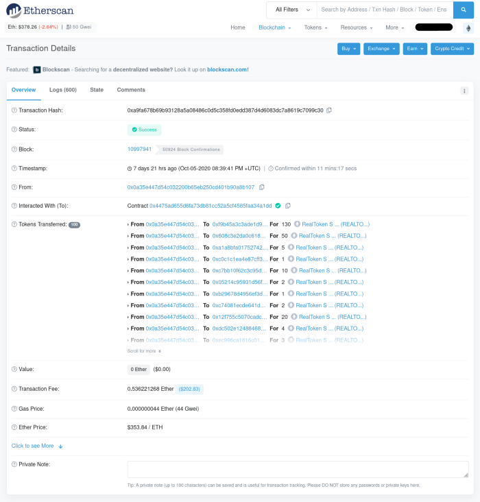
    <figcaption>Envío de tokens a los compradores de una propiedad específica en Etherscan</figcaption>
</figure>

Gracias a que esto está todo en el blockchain, las transacciones son TODAS auditables y vemos el costo que representa el envío de los tokens y la renta a RealT además de todas las direcciones a quienes son enviados todos los tokens y renta.

Podemos ver [un ejemplo](https://etherscan.io/tx/0x10ace1f995acb23b88f31f0399e3cd4e570bb6aae1f1df8d32776e12e5c73d74) de recepción de la renta, la cual se paga para todas las propiedades en conjunto en una transacción para todos los usuarios que poseen algún token de alguna propiedad:

<figure>
    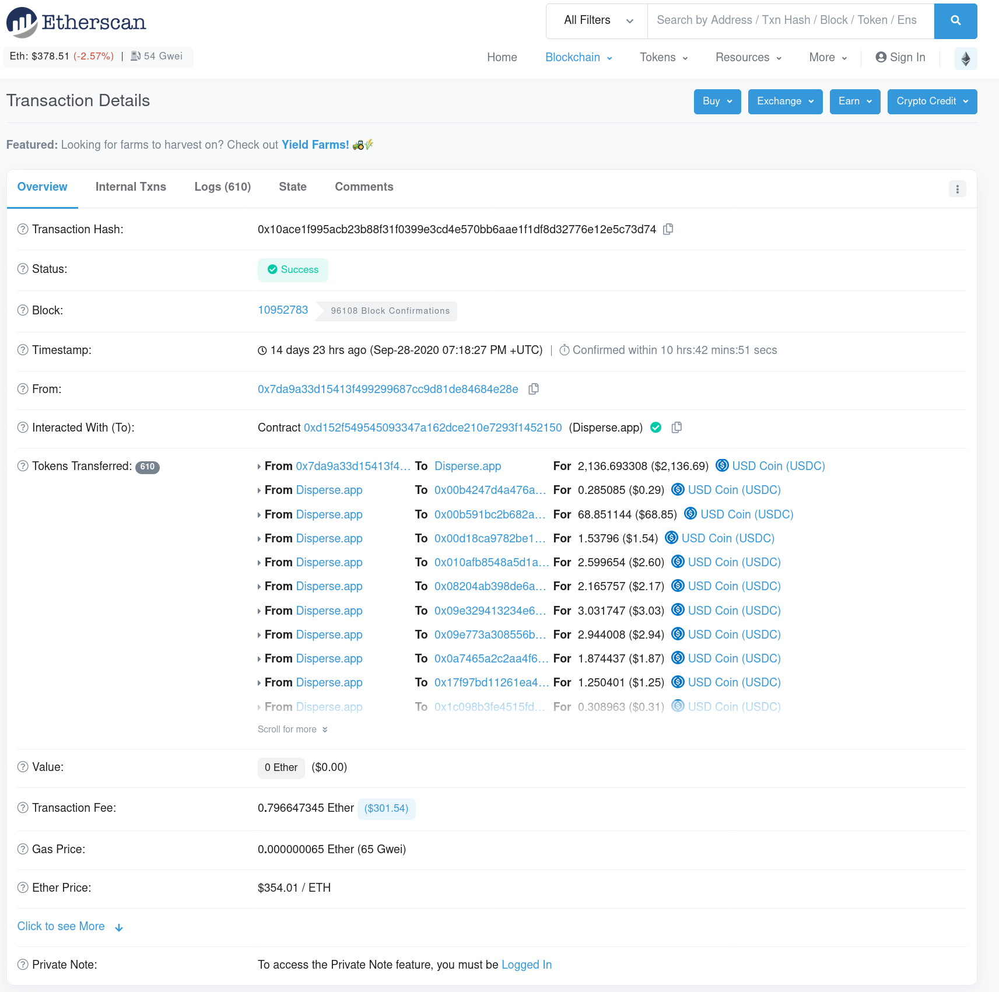
    <figcaption>La renta es enviada a los usuarios, donde la primera transacción de la lista es la renta enviada por RealT a disperse.app, una aplicación que RealT utiliza para distribuir la renta de todas las propiedades (correspondiente con ese período de pago) a todos los usuarios que posean tokens de RealT.</figcaption>
</figure>

- Vemos que la cantidad de renta recibida por este wallet (en USDC) en este ejemplo es de 13.734

<figure>
    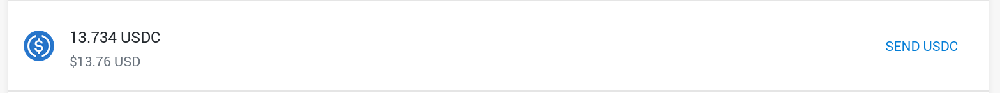
    <figcaption>USDC recibido por RealT.</figcaption>
</figure>

Y listo!, hemos recibido la renta por parte de RealT en nuestra cartera, ahora podemos mantenerla acá o podemos enviar el USDC recibido a un exchange como Coinbase y enviarlo a nuestra cuenta de banco si así lo deseamos.

***

### Monitorear la inversión

Luego de haber hecho la inversión, podemos visitar el [Dashboard de RealT](https://dashboard.realt.community/) que un miembro de la comunidad ha hecho para los usuarios y buscar nuestra dirección de nuestra cartera para ver como la renta llega, y un resumen de las inversiones:

<figure>
    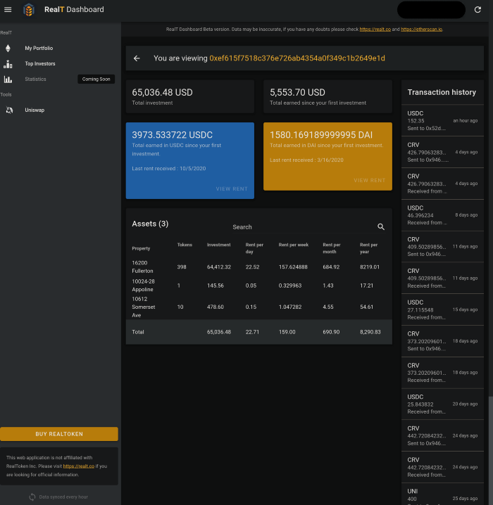
    <figcaption>Ejemplo de la inversión de un usuario.</figcaption>
</figure>

***

### ¡Gracias por leer este artículo!

A continuación las páginas web y servicios que hemos mencionado en este artículo:

- [RealT](https://realt.co/ref/dreth)

- [Dashboard de RealT](https://dashboard.realt.community/)

- [Metamask](https://metamask.io/)

- [Coinbase](https://www.coinbase.com)

