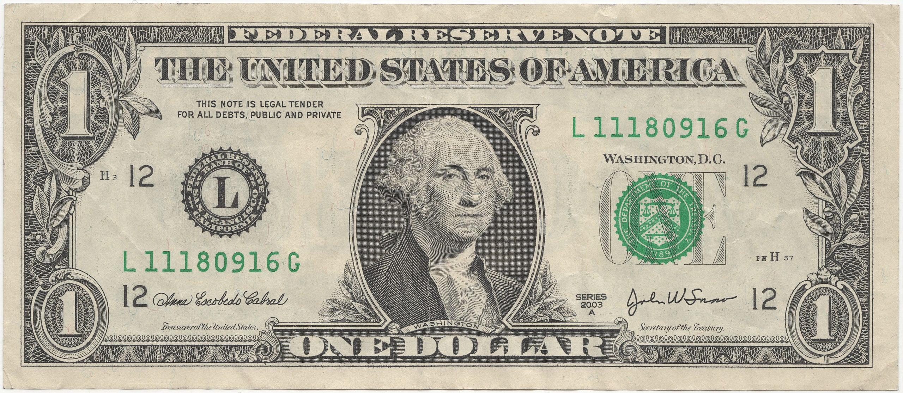
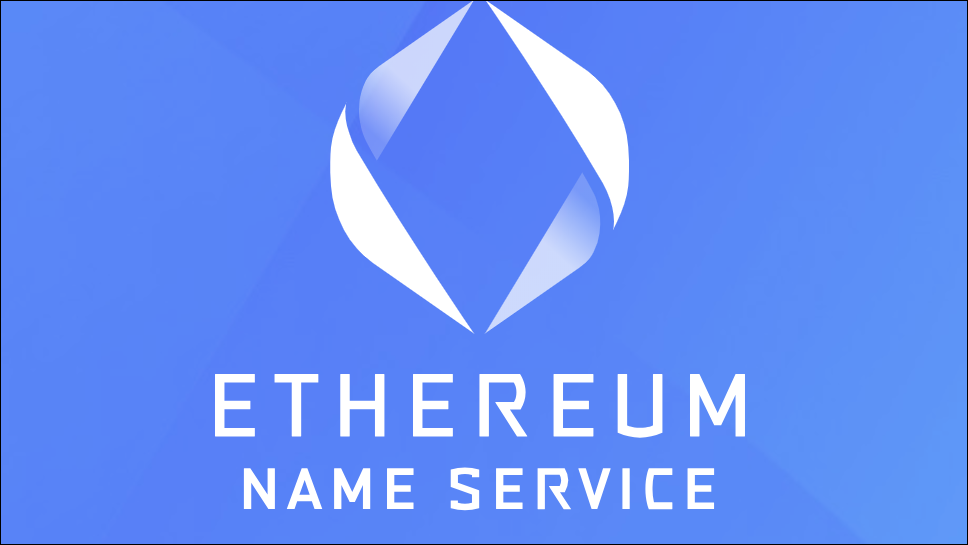
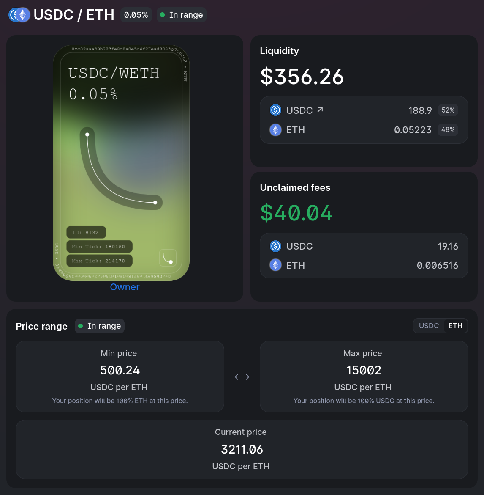
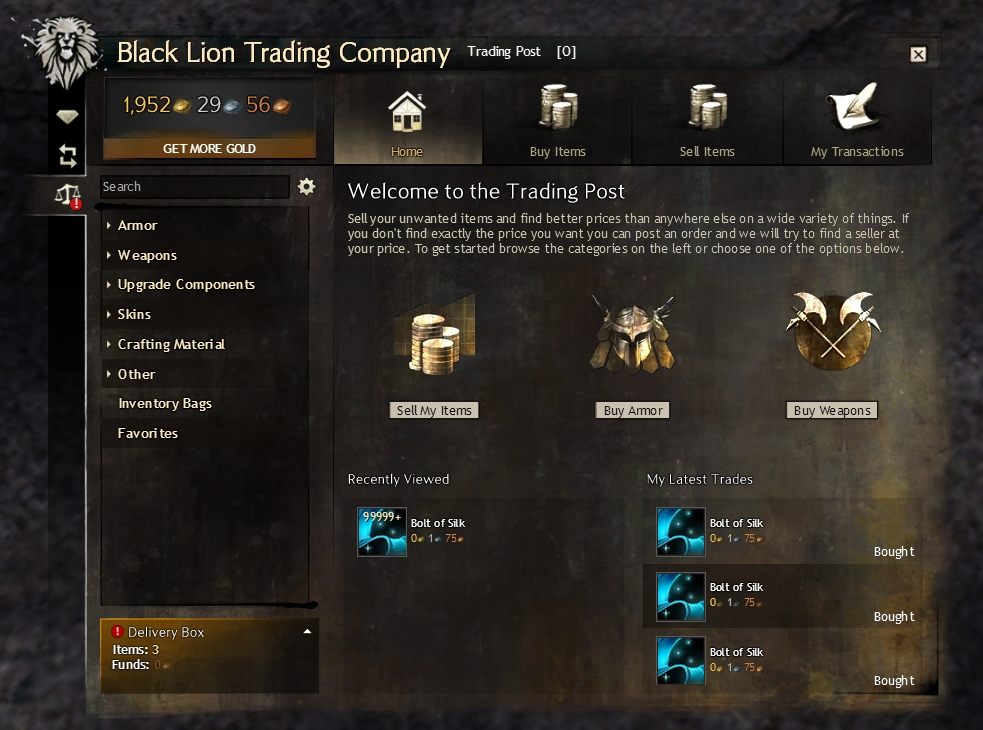

# Useful NFTs?

NFTs have taken the spotlight extremely quickly and suddenly everyone knows about their existence. From being a piece of technology that only people involved in the blockchain world knew about, to having tons of artists, famous or infamous, release their own collections, gaming companies attempt to introduce it in their gaming ecosystems with limited success or huge backlash, and existing crypto projects integrate it in their existing functionality.

They seem to be here to stay, but there's a lot of details people don't quite understand about these. Here I will try to demystify them, show some interesting use-cases for NFTs currently implemented, give my own opinion on their value justify it in some way. I write this because I find the topic fascinating, but also because I strongly dislike how the media have painted these, generally causing people to _despise_ the technology without quite understanding its use.

***

### Article index

  - [What is an NFT?](#what-is-an-nft)
    - [Fungibility](#fungibility)
    - [Non-fungibility](#non-fungibility)
  - [Tokens on the blockchain](#tokens-on-the-blockchain)
    - [Fungible tokens on the blockchain](#fungible-tokens-on-the-blockchain)
    - [Non-fungible tokens on the blockchain](#non-fungible-tokens-on-the-blockchain)
    - [Value](#value)
    - [Risks](#risks)
  - [Actually useful NFTs](#actually-useful-nfts)
    - [ENS names](#ens-names)
    - [Uniswap positions](#uniswap-positions)
    - [NFTs in MMOs and games with internal marketplaces](#nfts-in-mmos-and-games-with-internal-marketplaces)
  - [Conclusion](#conclusion)
  - [Image sources](#image-sources)

***

## What is an NFT?

According to my favourite source in the universe, [Wikipedia](https://en.wikipedia.org/wiki/Non-fungible_token), an NFT is:

> *A non-fungible token (NFT) is a non-interchangeable unit of data stored on a blockchain, a form of digital ledger, that can be sold and traded. Types of NFT data units may be associated with digital files such as photos, videos, and audio. Because each token is uniquely identifiable, NFTs differ from blockchain cryptocurrencies, such as Bitcoin.*

> *NFT ledgers claim to provide a public certificate of authenticity or proof of ownership, but the legal rights conveyed by an NFT can be uncertain. NFTs do not restrict the sharing or copying of the underlying digital files, do not necessarily convey the copyright of the digital files, and do not prevent the creation of NFTs with identical associated files.* 

Interesting, but somewhat unspecific. Let's break it down a little.

### Fungibility

Fungibility means that a product, commodity or asset is replaceable by another identical item, basically making them mutually interchangeable. One example that we can think of in the real world is a dollar bill.

All our monetary units, be it coins or paper money are fungible. This means that 1 dollar bill is completely interchangeable with another, they hold the same value and represent the exact same underlying asset, *one dollar*.

### Non-fungibility

When an product, commodity or asset is _non fungible_, it is fundamentally unique. Meaning that it is impossible to make it interchangeable with another item, no matter how similar it looks or how identical their functionality or purpose is. An example we can think of is a Leonardo da Vinci painting like _Salvator Mundi_ :

Only one copy of it exists, Leonardo could've painted three copies of this artwork, but he didn't, he painted one. However, had he painted three, then we would have _Salvator Mundi No.1_, _Salvator Mundi No.2_ and _Salvator Mundi No.3_, which would all be unique in their own way, or identical, but still unique at least in the order in which they were painted, thus retaining some difference between each other in terms of order (assuming Leonardo could reproduce 3 copies of it in absolutely perfect order like a robot).

***

## Tokens on the blockchain

Sufficiently distributed and decentralized blockchains are perhaps the most trustworthy systems we can have. Where trust is _not even needed_ to perform a handshake or agreement, simply a digital signature. 

Now that we have a couple of examples, one of fungibility and another one of non-fungibility, we can move on to the last piece of the puzzle: tokens.

### Fungible tokens on the blockchain

**With some blockchain-specific terminology**: A token on the Ethereum blockchain, other Ethereum Virtual Machine (EVM) compatible blockchains, and other non-EVM blockchains, is typically a smart contract, basically an address that corresponds to a script, a piece of code with attributes and methods. One of the most fundamental and basic smart contracts one can have are tokens. These will normally have functions that allow for the tokens to be moved from one wallet to another, attributes that describe how much of that token any given address has, etc...

**Without any blockchain-specific terminology**: A token on the Ethereum blockchain or other similar blockchains is basically an object with some properties and functionality. It can represent some real life currency, meaning it can be transferred (sent from one wallet to another), as well as in-game currency, voting rights, a company's shares, etc...

Anything we can represent in real life with a symbolic plastic token, identical to other plastic tokens that serve its same purpose, we can represent with a token on the blockchain, except it can be done in a permissionless manner. Anyone can interact with the token, anyone can (if the deployer chooses to) see the definition of the token publicly, all in a permissionless manner. 

Let's illustrate this with an example, the *stablecoin* (meaning its value is pegged to that of a specific fiat currency) USDC:

- USDC is a **fungible** token on the blockchain, meaning 1 USDC in my wallet is identical to another 1 USDC in someone else's wallet.
  
- 1 USDC always represents 1 USD in real life (in [Centre's](https://www.centre.io/) reserves)
  
- USDC follows the ERC-20 standard for tokens, which is a set of rules to follow when deploying a token contract on the Ethereum blockchain ([Investopedia](https://www.investopedia.com/news/what-erc20-and-what-does-it-mean-ethereum/) has an OK article on what this means, in case you want to read further)
  
- Any amount of USDC can be transferred from one wallet to another by interacting with the [USDC smart contract](https://etherscan.io/address/0xa0b86991c6218b36c1d19d4a2e9eb0ce3606eb48#code), for example, if I have 10.5 USDC in my wallet and I want to send it to a friend, I will take my software (or hardware) wallet, click on the 10.5 USDC in my account and then click send on the wallet. This will call the function `transfer()`, through which we can specify how much we want to send and to what address we want to send it:

### Non-fungible tokens on the blockchain

Non-fungible tokens or NFTs are a specific type of token on the blockchain that follows a different standard (ERC-721 or ERC-1155) to fungible tokens (ERC-20). These tokens have several interesting properties. 

Just like fungible tokens, they can be transferred from one wallet to another, however, each one must be part of a *collection*. So there's only a *finite* amount of them, and each one of them is *unique*, just like with paintings, except these live on the blockchain.

They can represent actual digital media, like an image, a video or an audio file. Typically there will be an attribute/property written in the token implementation that points to an external resource. This external resource is usually hosted on the IPFS, but can also be hosted on any web server as long as the address is publicly accessible.

For example, let's look at **CryptoPunk #5136**:

It has several properties:
- It belongs to a [collection](https://etherscan.io/address/0xb47e3cd837ddf8e4c57f05d70ab865de6e193bbb), which we can also see on an NFT marketplace like [LooksRare](https://looksrare.org/collections/0xb47e3cd837dDF8e4c57F05d70Ab865de6e193BBB).
- The NFT belongs to [this address](https://opensea.io/0xcffc336e6d019c1af58257a0b10bf2146a3f42a4).
- The NFT contains the image shown above referenced in its attributes, which we can query [here](https://www.larvalabs.com/blog/2021-8-18-18-0/on-chain-cryptopunks?query=5136), on larvalabs' official website. 

This does *not* mean that the owner of this NFT owns *the image*, but rather the *token* on the blockchain which points to this image on an external server.

Yes, there are instances where the asset represented by the token is not an external resource outside of the blockchain, but typically this is the case.

We can question the utility of tokens like *CryptoPunks*, but there's not much use in discussing the utility of *Salvator Mundi* either, both are art, and they can be used for whatever its owner wants to use it.

### Value

As humans, we tend to place value to unique items with special and unique qualities, which is why paintings like the aforementioned hold such a massive monetary value. If someone will pay *x amount* for it, then it is worth *x amount*. 

In the case of this legendary painting we can say that this value, no matter how large, is perfectly justified, after all **this is a painting by Leonardo da Vinci**. I tend to agree with this view, some things **should** hold a high value, others perhaps **should not**, whether fungible or non-fungible. 

The question some people ask me is, and excuse them for cussing, "Why the **FUCK** is this piece of **SHIT** jpeg being sold for millions?". To which I first would say "chill bro" and then explain that people *like money*, people *want money*, because money is useful, and people *speculate* on the value of assets with the purpose and intent to *make money*. Sure let's not discard those individuals that do have some sort of emotional attachment to their CryptoPunk or Bored Ape, it's not like they paid 200K for them or something... However, these are not the majority of people trading these digital assets. The majority will buy these to try and flip them for a profit, simple as that, you have a lot of ETH to buy one of these, then you can get a lot of ETH for selling one of these and (hopefully) even more than what it initially costed you.

### Risks

As a result, these digital assets command huge levels of trading volume between speculators and traders. Though they carry additional risk that other digital assets do not always carry:

- **Liquidity**: The NFT market is largely illiquid, given that the tokens tend to have a relatively steep price and there's *so many* different collections of them, holding NFTs that do not belong to extremely popular collections like CryptoPunks tend to result in you buying the asset for more than you can get by selling it.
  
- **Next-big-thing disease**: NFT collections that do not *catch on* will lose value and interest of speculators, and as with every market, there's losers and there's winners. With NFTs, the losers are those that are left holding the assets with no possibility of selling it, or forced to sell them at a loss. The winners are those that will successfully flip them for a profit, or at least break even.
  
- **Lack of continued development from creators**: An NFT collection may be created by a large team of engineers, artists or perhaps a large conglomerate or company. Though it can also be created by some anonymous dude on telegram that got paid a couple thousand bucks to copy-paste a popular collection's smart contract, lightly modify it and do all the tedious work that requires deploying an NFT collection on the Ethereum blockchain. Creators that do not show active development activity or creation of an ecosystem around their collection tend to fall into irrelevancy. 

***

## Actually useful NFTs

NFTs have all sorts of novel uses, they can represent real-life assets, they can represent other digital assets, but I want to focus on 2 specific use cases of these tokens on the blockchain, as well as 1 hypothetical use for them in a game I personally used to play.

### ENS names

ENS names are NFTs that have a specific domain name functionality on the blockchain. With domains like **startpage.com**, we can refer to network locations or resources in a human-readable way. For example, [**startpage.com**](https://startpage.com) will redirect to the StartPage search engine, which is a website hosted in some server. The 'original' address for this resource (the StartPage search engine website) could be a much longer and difficult to remember address than **startpage.com**, but domain names allow us to recognize these locations and remember them.

ENS names point, instead, to a resource on the blockchain, as of now, they point to addresses on the blockchain like **`0x8f51f2bdbaa3a10ae0fac783ab7ec86cfb11ae58`**, which is noticeably difficult to remember. The ENS name **`domains.eth`**, for instance, resolves to that address.

So whenever we want to send Ether or any token to **`0x8f51f2bdbaa3a10ae0fac783ab7ec86cfb11ae58`**, we can use **`domains.eth`** instead of the long address. 

This also allows us to identify addresses more easily on block explorers, for example, on the etherscan page for [this address](https://etherscan.io/address/0x8f51f2bdbaa3a10ae0fac783ab7ec86cfb11ae58) (the one we have already mentioned a few times on this section), shows **`domains.eth`** in the *From* column of the table showing the transactions. This makes looking at [transactions](https://etherscan.io/tx/0xae3ab2676f102d5c04436af2c43dfa543abe9a0a30561ea7d0aa37bce93a30f2) comming from addresses like that one much more recognizable.

And to draw a parallel with the world outside of the blockchain, we also give unreasonable values to domain names (like the ~25K USD [water.com](https://www.godaddy.com/domain-value-appraisal/appraisal/?checkAvail=1&domainToCheck=water.com)), and thus, we also give unreasonable values to ENS names (like the ~19K USD [iphone.eth](https://etherscan.io/tx/0x4df14693c146464c58f2f48c851c08b23c2f44ac0fa63b734e77ce8f7f32ba4d)). A recognizeable, well known, name or brand name can be very valuable.

### Uniswap positions

Uniswap is a decentralized exchange originally deployed on Ethereum, it's a type of exchange called Automated Market Maker or AMM. Uniswap allows users to put crypto assets like ETH and USDC in a liquidity pool, where the user can choose to allocate a specific amount of ETH or USDC depending on several factors like the price relation of these two assets and the range in which the user wants to pool the liquidity.

Uniswap positions earn trading fees from trades that users perform between two crypto assets for any specific trading pair.

Uniswap uses NFTs to represent these liquidity positions. For instance, let's take the liquidity position [No. 8132](https://app.uniswap.org/#/pool/8132?chain=mainnet), this liquidity position is represented by an NFT belonging to the collection *Uniswap Positions*. This NFT was created when a user put forth an amount of ETH and amount of USDC in the ETH/USDC liquidity pool that charges 0.05% fees per trade to traders in the range 500.24 to 15002 USDC per ETH.

This liquidity position currently contains 356.26 USD worth of assets (split between USDC and ETH), the position has earned around 40.04 USD in fees which have yet to be claimed by the liquidity provider. 

This NFT representing this position entitles the owner of it to the entirety of the liquidity and fees contained in this liquidity position. Therefore, this user can, at any time decide to withdraw (or deposit) funds into this specific liquidity position whenever they want as long as they hold this NFT in their wallet.

### NFTs in MMOs and games with internal marketplaces

Now on to an example of NFT use applied to a massive multiplayer online (MMO) game that I used to play, Guild Wars 2.

Guild Wars 2 has an [in-game marketplace](https://wiki.guildwars2.com/wiki/Trading_Post) where users can sell items, these items often trade for high [*gold*](https://wiki.guildwars2.com/wiki/Coin) (main in-game currency) values, which often either require **a lot** of play time to acquire, or the conversion of [*gems*](https://wiki.guildwars2.com/wiki/Gem) (purchaseable in-game currency) to gold. 

Gold **cannot** be purchased from anyone, not even the game developer ArenaNet, and it is strictly banned. If ArenaNet catches you selling or buying gold from other users for real-life money, they will ban your and the seller's account. This, however, does not discourage people from buying or selling in-game gold in third-party marketplaces, as gold can be sent through the in-game mail system.

Gems, however, can be purchased directly from ArenaNet or authorized third party sellers. This, also, does not discourage unauthorized sellers from selling cards that can be redeemed for gems in-game, after acquiring them through either money laundering (buying them at original price from an official reseller and selling cheaper to launder the money), or some other legal (or illegal) way.

Gold obtained through either gameplay or gem conversion can later be used to purchase items from the in-game marketplace. There's a set of highly desirable items that are purchaseable through the in-game marketplace called [*legendary weapons*](https://wiki.guildwars2.com/wiki/Legendary_weapon). These take **a lot** of hours of gameplay to create, hundreds of hours even, and a lot of in-game tasks. Many people create these with their work just to obtain gold for other purposes, usually other cosmetic items or even in-game [*gambling*](https://wiki.guildwars2.com/wiki/Ecto_gambling).

Guild wars 2 legendary weapons (and similarly expensive items) could be a perfect candidate for NFTs, and here I want to present some arguments why this is a good idea:

- NFTs are tokens on the blockchain and transactions on the blockchain are *public*, therefore ArenaNet would have greater control over who is selling or buying large amounts of these in-game items
  
- NFTs are purchased with cryptocurrency, which we can value in an objective manner in the open market in fiat currency. So the value of these in-game items as NFTs would be objective and would not require the many different conversions that buying highly valued in-game items in gold requires (Fiat currency <--> Gems <--> Gold <--> In-game item)
  
- ArenaNet could charge royalties on the exchange of these goods in a highly liquid and *actually useful and valuable currency* outside of Guild Wars 2, like ETH.
  
- People [**buy and sell these for money**](https://www.reddit.com/r/Guildwars2/comments/4il4zr/buying_legendary_weapons_with_gems/) anyway, there is absolutely NO need for ArenaNet to spend resources and energy trying to combat a third-party market that will exist anyway. They could, instead, be the *owners* of this market, creating restrictions for these items to be traded exclusively through their own market.

Just like Guild Wars 2, other games could implement NFTs in a way the user *doesn't even know* they're using NFTs, thereby avoiding any [unnecessary backlash](https://cointelegraph.com/news/ubisoft-executive-responds-to-the-backlash-over-new-nft-platform) trying to force the concept down your clients' (gamers) throat.

NFTs are NOT a feature, they are, like screwdrivers, a tool, a path to a goal, and companies and people alike should learn to treat them as such.

***

## Conclusion

NFTs can be and are very useful, we're just too focused on a speculative and quite frankly very stupid market where everyone, like us, are just tryna' get some cash.

Keep in mind that art, music and design are still a perfectly acceptable uses for NFTs, and I hope lots of artists are able to extract and create value for themselves through them. 

This is not financial advice, but I want to end with a recommendation after indulging in these markets as a risk-averse, careful investor:

- Do not buy illiquid digital assets with money that you can't afford to lose.
  
- Do not buy NFTs from random collections unless you're absolutely sure you can bear the loss.
  
- Do not bet your livelihood on JPEGs.

- Buying art is OK, supporting artists is great. Support artists and not some scammers' quickly and loosely put together cash grab NFT collection.
  
- Inform yourself before you say NFTs are 'useless'. They're not useless, they're pretty cool, and are here to stay whether you like it or not.

## Image sources

I'll only source externally obtained images, these are in order. Images I do not source I either took a screenshot of or created on my own.

1. [Dollar bill](https://commons.wikimedia.org/wiki/File:United_States_one_dollar_bill,_obverse.jpg)
   
2. [Salvator Mundi](https://commons.wikimedia.org/wiki/File:Leonardo_da_Vinci,_Salvator_Mundi,_c.1500,_oil_on_walnut,_45.4_%C3%97_65.6_cm.jpg)
   
4. [CryptoPunk #5136](https://opensea.io/assets/0xb47e3cd837ddf8e4c57f05d70ab865de6e193bbb/5136)
   
5. [ENS logo](https://gadgetstouse.com/blog/2022/02/05/ens-domain-buy-create-register/)

7. [Guild wars 2 trading post](https://wiki.guildwars2.com/wiki/Trading_Post)

***

**Date: February 10, 2022**
