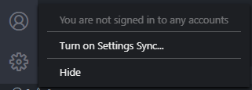
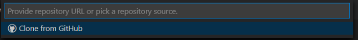
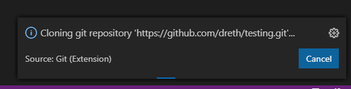
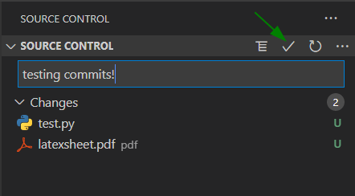

# How to set up a Data Science environment on Windows using Visual Studio Code

<b>November 16, 2020</b>

It is no mystery that I am profoundly in love with VS Code in many more ways than I’m comfortable admitting. Since my good friend Victor showed me the power of this application, I not only have never gone back to any other code editor but I’ve also even replaced other tools with it.

I’m currently doing a master’s degree and I have found myself using it as not only my main code editor and development environment but also my main tool for editing documents, opening PDFs, editing my site, etc…

***

### Tutorial index

  - [Why VS Code?](#why-vs-code)
  - [Step 1: Install Anaconda](#step-1-install-anaconda)
  - [Step 2: Install VS Code](#step-2-install-vs-code)
  - [Step 3: Install Git](#step-3-install-git)
  - [Step 4: Set up our environment in VS Code](#step-4-set-up-our-environment-in-vs-code)
    - [Must have extensions (IMO)](#must-have-extensions-imo)
  - [Step 5: Syncing your extensions, UI and settings](#step-5-syncing-your-extensions-ui-and-settings)
  - [Step 6: Pushing code to your repos on github](#step-6-pushing-code-to-your-repos-on-github)
    - [Creating and cloning private repositories](#creating-and-cloning-private-repositories)
    - [Committing code and pushing it](#committing-code-and-pushing-it)

***

### Why VS Code?

A few simple reasons without explanation and in no specific order:

- It’s [mostly open source](https://github.com/microsoft/vscode) (it’s microsoft’s distribution of code-oss)
- It’s [incredibly customizable](https://marketplace.visualstudio.com/vscode)
- It’s free
- It can edit scripts written in pretty much any programming language

Now that I’ve convinced you with my incredibly detailed explanation of why it’s good, we’re ready to install it and set up our development environment.

***

### Step 1: Install Anaconda

Anaconda is an open source distribution that includes Python along with several other applications you can install.

It also includes several libraries that are useful for data science, machine learning, numerical operations and such.

1- Go to the [Anaconda website](https://www.anaconda.com/products/individual)

<figure>
    
    <figcaption>Anaconda website.</figcaption>
</figure>

2- Click on download and select the download for your platform, in this case Windows.

<figure>
    
    <figcaption>Installers per platform.</figcaption>
</figure>

3- Click on 64-Bit or 32-Bit depending on your system, most computers these days run 64-Bit operating systems.

<figure>
    
    <figcaption>We click on Windows 64-Bit or 32-Bit depending on your system.</figcaption>
</figure>

4- We wait for the download to finish.

<figure>
    
    <figcaption>Downloading the installer.</figcaption>
</figure>

5- We open the installer file and follow the setup. Click on next after opening.

<figure>
    
    <figcaption>Anaconda setup 1st step..</figcaption>
</figure>

6- We agree with the license agreement.

<figure>
    
    <figcaption>License agreement.</figcaption>
</figure>

7- Install for just your user or for all users, ideally just yours.

<figure>
    
    <figcaption>Installation type.</figcaption>
</figure>

8- Choose the install location, be mindful that anaconda requires 2.7GB of space.

<figure>
    
    <figcaption>Install location.</figcaption>
</figure>

9- Make sure to register anaconda as your default python 3, this is the default option. Then click install.
  
<figure>
    
    <figcaption>Click install.</figcaption>
</figure>

10- Wait for the installation to be done and then open cmd (Windows button -> type cmd -> open cmd). You should see the command prompt come up, type conda init and then enter on your keyboard.

<figure>
    
    <figcaption>conda init command in command prompt.</figcaption>
</figure>

11- Test if the environment has been initialized by typing “conda activate base” and then enter on your keyboard.

<figure>
    
    <figcaption>conda activate base command in command prompt.</figcaption>
</figure>

If you see base to the left of the path you’re in, then we’re done setting anaconda up!

***

### Step 2: Install VS Code

In this next step we install VS Code. This only encompasses the process of getting the application installed, we will then set it up in [Step 4](#step-4-set-up-our-environment-in-vs-code) to work well with Python or R.

*Note: **Rstudio** is probably a better code editor for **R**, however, you can still open R files or R notebooks in VS Code and run them as long as you have the R interpreter installed on your computer.*

1- Go to the [VS Code website](https://code.visualstudio.com/). It’ll show the version to download for your platform in the blue download button.

<figure>
    
    <figcaption>VS Code site.</figcaption>
</figure>

2- Upon clicking we should get the download to start.

<figure>
    
    <figcaption>VS Code Setup Download.</figcaption>
</figure>

3- Once the download is compelted, we open the installer.

<figure>
    
    <figcaption>Download finished.</figcaption>
</figure>

4- We accept the license agreement and continue.

<figure>
    
    <figcaption>License Agreement.</figcaption>
</figure>

5- We select the installation folder, we can just leave the defaul there and continue.

<figure>
    
    <figcaption>Folder to install.</figcaption>
</figure>

6- We decide whether to include it in the start menu or not and continue.

<figure>
    
    <figcaption>Start menu folder.</figcaption>
</figure>

7- We add code to PATH and select additional options we may want. I personally would add the “Open with Code” option to the windows explorer context menu and register the application for the supported file types.

This is completely optional though.

<figure>
    
    <figcaption>Extra options.</figcaption>
</figure>

8- We install the application

<figure>
    
    <figcaption>Final confirmation with options.</figcaption>
</figure>

9- We wait for the installer to do its thing.

<figure>
    
    <figcaption></figcaption>
</figure>

10- And we’re done, we can decide to launch VS Code now, we can go ahead and do that and [go to Step 3](#step-3-install-git).

<figure>
    
    <figcaption></figcaption>
</figure>

Done!

*Note: when opening VS Code for the first time you might get a firewall prompt like the following:*

<figure>
    
    <figcaption>Firewall access request.</figcaption>
</figure>

When this comes up, make sure to **allow access**!

Now we set up VS Code. It might seem daunting at first but the application is actually quite intuitive once you start diving into it. I’ll cover as much as I can in this guide.

***

### Step 3: Install Git

An important part of developing things is to be able to publish them somewhere. Or just have a backup of them!

I personally really like services like [Github](https://github.com/) or [Gitlab](https://gitlab.com/) to host my own projects, and there’s no way to push stuff into your own repositories if you don’t have git. So we’re gonna go ahead and install that now.

1- Go to the [git downloads site](https://git-scm.com/downloads) and click on the download for your platform.

<figure>
    
    <figcaption>git download site.</figcaption>
</figure>

2- The installer download should start

<figure>
    
    <figcaption>installer download.</figcaption>
</figure>

3- We open the installer and accept the administrative privilege request

<figure>
    
    <figcaption>administrative privilege request.</figcaption>
</figure>

4- We click on next and continue through the installer

<figure>
    
    <figcaption>Accept the information and click next.</figcaption>
</figure>

5- We select the installation location. We can just leave the default one. Git occupies ~258 MB of space.

<figure>
    
    <figcaption>Select installation location.</figcaption>
</figure>

6- We select the features we want. You could just leave this as default or take off windows explorer integration in case you don’t want to have another option in your windows explorer context menu (the menu that comes up when you right click inside a folder of your windows explorer).

<figure>
    
    <figcaption>Components selection menu.</figcaption>
</figure>

7- We select whether to install or not in start menu. I’d keep this as default.

<figure>
    
    <figcaption>Start menu shortcut installation.</figcaption>
</figure>

8- Default editor used by Git. Select VS Code as the default editor for git.

<figure>
    
    <figcaption>the default editor’s option is Vim.</figcaption>
</figure>

<figure>
    
    <figcaption>Selecting Visual Studio Code as git’s default editor.</figcaption>
</figure>

9- For the next steps, we can just keep the default options, but I will include the screenshots for the sake of completion.

<figure>
    
    <figcaption>Initial branch name option.</figcaption>
</figure>

<figure>
    
    <figcaption>This option is important, don’t change it.</figcaption>
</figure>

<figure>
    
    <figcaption>HTTPS transport backend. Leave OpenSSL as default.</figcaption>
</figure>

<figure>
    
    <figcaption>We can leave this as default as well.</figcaption>
</figure>

<figure>
    
    <figcaption>Default!</figcaption>
</figure>

<figure>
    
    <figcaption>Keep going.</figcaption>
</figure>

<figure>
    
    <figcaption>Keep as default as well. The default option is awesome.</figcaption>
</figure>

<figure>
    
    <figcaption>Keep going!, we’re almost done.</figcaption>
</figure>

10- Keep this option as default (unchecked) and click install!

<figure>
    
    <figcaption>Click install.</figcaption>
</figure>

11- We wait for the installation to finish and we’re done installing git!

<figure>
    
    <figcaption>Installation process.</figcaption>
</figure>

12- You can choose to view release notes if you’re interested, otherwise uncheck the option and finish!

<figure>
    
    <figcaption></figcaption>
</figure>

We’re done installing git, now we can commit content to platforms like github or gitlab right from VS Code when we get it set up, which is the next step.

***

### Step 4: Set up our environment in VS Code

This section of the tutorial will be a bit longer but I will try to explain everything in as much detail as I can.

Now we have VS Code open and we’re greeted with the following Welcome page.

Currently, VS Code is JUST a text editor, it can’t run a lot of files yet, but we have the wonderful gift of extensions. VS Code extensions is what makes the application such a powerful tool, along with all the cool things it has.

Let’s get it set up!

1- Click on the little blocks icon on the left bar.

<figure>
    
    <figcaption>VS Code welcome page. The extensions icon is marked in red.</figcaption>
</figure>

2- We see the list of extensions by amount of downloads. All these extensions are awesome and they make this application the full programming suite that it is.

There is a whole world of extensions out there. I’ll go through a few that I think are absolutely amazing and will serve greatly when working with data.

<figure>
    
    <figcaption>VS Code extensions.</figcaption>
</figure>

### Must have extensions (IMO)

**The Python and Jupyter extensions.**

This adds support for anything related to python, including notebooks and linting.

You still should install this extension even if you don’t work with python, as it adds support for jupyter notebooks.

Installing the python extension installs he jupyter extension automatically.

<figure>
    
    <figcaption>Python extension.</figcaption>
</figure>

<figure>
    
    <figcaption>Jupyter extension.</figcaption>
</figure>

Jupyter Notebooks work once the extension is installed (it comes with the python extension though). If you have R installed, R notebooks will also work out of the box, or pretty much any kernel that you select as long as it’s supported (Julia works well too).

<figure>
    
    <figcaption>Jupyter notebook with an R kernel in VS Code.</figcaption>
</figure>

**Running Python scripts**

Obviously, we want to be able to run python scripts as well (.py files). VS Code allows us to run the files in either our default shell or interactive (which is an IPython console that quite resembles a notebook.

1- Let’s open a folder

<figure>
    
    <figcaption>Open folder button.</figcaption>
</figure>

And let’s select the folder we want to work on, this first folder is just an example folder I made on the desktop

<figure>
    
    <figcaption>Example folder.</figcaption>
</figure>

2- Let’s create a test script using the new file button, pointed by the green arrow. First button from left to right.

<figure>
    
    <figcaption>test.py file.</figcaption>
</figure>

3- Let’s write something simple to test whether things run smoothly

<figure>
    
    <figcaption>Importing a few libraries and printing a line.</figcaption>
</figure>

4- Before running it, let’s set our desired kernel.

<figure>
    
    <figcaption>We can see on the bottom left that the kernel is set correctly.</figcaption>
</figure>

To change the kernel, click on where it says “Python 3.8.3…” this will pop up the kernel selection menu. Let’s select the conda path, the only one that pops up here. This is an important step, as some other platforms come with python preinstalled and the default path might be different.

<figure>
    
    <figcaption>Select your desired kernel.</figcaption>
</figure>

5- Now that we have selected the right kernel, we now check whether this indeed works in your shell.

First click on *Run python file in terminal.*

<figure>
    
    <figcaption>Run options.</figcaption>
</figure>

One thing to note here is that we could get this nasty error if we are using powershell as our default shell and it’s never been initialized:

<figure>
    
    <figcaption>nasty error.</figcaption>
</figure>

We can solve this by changing our default shell to cmd, as we have already initialized it before (when installing anaconda by running *conda init* in cmd).

6- On the top right of the shell, we can see a drop down menu. Let’s click on select default shell

<figure>
    
    <figcaption>Shell selection menu.</figcaption>
</figure>

Pick command prompt as your default shell

<figure>
    
    <figcaption>Shell options.</figcaption>
</figure>

Close the previous shell through the little trash can button

<figure>
    
    <figcaption>integrated shell menu options.</figcaption>
</figure>

7- Run the script again after having picked command prompt as default shell

<figure>
    
    <figcaption>It works!</figcaption>
</figure>

Great!, the option to *Run python file in interactive window* should work out of the box after picking the default interpreter

<figure>
    
    <figcaption>Python interactive.</figcaption>
</figure>

After getting things up and running with python, we can continue with more awesome extensions.

**The R extension.**

This is a bit of a choice that I personally make as sometimes I’m working with Python files or R files, and I like to have the ability to edit both, along with run jupyter notebooks with an R kernel.

<figure>
    
    <figcaption>R extension.</figcaption>
</figure>

**The Julia extension.**

You see where this is going? if you want support for a specific programming language, you just search for the programming language extension in VS Code and it’ll usually come with the support you need and you’ll be able to run/interpret/compile code using that programming language as long as you have what you need installed on your computer.

The julia extension adds Julia language support, for using Julia with notebooks you will have to have IJulia installed and the julia binary in your PATH. As far as I know, the julia binary will be installed to your PATH by default when you install Julia in your computer.

Remember, extensions *add such programming language support to vscode but they do NOT install the programming language compiler/interpreter on your computer.*

Just like with Python, R or Julia, you can install basically any programming language support to your VS Code editor.

<figure>
    
    <figcaption>Julia extension.</figcaption>
</figure>

**Rainbow CSV.**

This is amazing. Absolutely amazing. It’ll allow you to open CSV and TSV files (comma separated or tab separated) on VS Code with a little bit of a twist.

VS Code comes with support for any text file by default, however, this gives you an excel-like perspective of any CSV/TSV file.

<figure>
    
    <figcaption>Rainbow CSV extension.</figcaption>
</figure>

Here you can see an example without the extension

<figure>
    
    <figcaption>CSV file in VS Code without rainbow CSV extension.</figcaption>
</figure>

Here you can see the same file with the extension enabled

<figure>
    
    <figcaption>CSV file with the extension enabled.</figcaption>
</figure>

And you can even align a file’s columns or query the file

<figure>
    
    <figcaption>Aligned columns</figcaption>
</figure>

Querying the file using SQL-like queries

<figure>
    
    <figcaption>Creating the query “select * where a3 > 10000”</figcaption>
</figure>

and executing queries will return the same CSV with the entries matched by the query

<figure>
    
    <figcaption>Query result.</figcaption>
</figure>

**Themes!**

You can get any theme you like for it, for example this one!

<figure>
    
    <figcaption>One monokai theme extension.</figcaption>
</figure>

Before the theme:

<figure>
    
    <figcaption></figcaption>
</figure>

After the theme:

<figure>
    
    <figcaption></figcaption>
</figure>

And we can also customize the icons we see for files in the integrated file explorer:

<figure>
    
    <figcaption>Material Icon Theme extension.</figcaption>
</figure>

Before applying the icon theme:

<figure>
    
    <figcaption>the stuff in my downloads folder with original icons.</figcaption>
</figure>

After applying the icon theme:

<figure>
    
    <figcaption>We can see that all icons but the .exe or msi files changed.</figcaption>
</figure>

And there’s thousands to choose from.

**PDF Reader**

I personally work with PDFs regularly when doing programming exercises, or when reading papers, maybe reading cheat sheets when working with regular expressions or latex, or previewing a latex file after compiling!

You can use the vscode-pdf reader extension to explore PDF files by just opening them like you’d open any other file inside VS Code

<figure>
    
    <figcaption>vscode-pdf extension.</figcaption>
</figure>

<figure>
    
    <figcaption>A PDF file inside VS Code.</figcaption>
</figure>

**Editing/compiling LaTeX files**

If you already work with latex, you can use the LaTeX Workshop extension which includes a PDF reader

<figure>
    
    <figcaption>LaTeX Workshop extension.</figcaption>
</figure>

Here I can have the .Tex file, the preview PDF and a cheat sheet open side by side:

<figure>
    
    <figcaption>file explorer | .tex file | preview PDF | cheat sheet.</figcaption>
</figure>

When opening a PDF using this extension we might get the following prompt

<figure>
    
    <figcaption>open anyway.</figcaption>
</figure>

Make sure to click on open it anyway and it should work fine as long as you have this extension or vscode-pdf installed.

***

### Step 5: Syncing your extensions, UI and settings

There’s an extension called Settings Sync in the VS Marketplace which worked amazingly. However, this was recently added to VS Code as a built in feature. I’ll quickly walk you through it.

On the bottom left you should see a typical user account icon.

1- Click on it and click turn on **settings sync**

<figure>
    
    <figcaption>Settings sync.</figcaption>
</figure>

2- You’ll be asked what you’d like to sync.

Select your desired options and click on **Sign in & Turn on**.

<figure>
    
    <figcaption>Sync options.</figcaption>
</figure>

3- You’ll then be asked whether you want to use a Microsoft or Github account.

<figure>
    
    <figcaption>Sign in options.</figcaption>
</figure>

Either option works fine but I will recommend going with Github, they will redirect you to their specific login pages and you can just log in and go through with it.

<figure>
    
    <figcaption>Microsoft account option.</figcaption>
</figure>

I’ll go with the github option, as for me it makes more sense to sync VS Code with github.

After logging in you should see the following prompt

<figure>
    
    <figcaption>Authorization request.</figcaption>
</figure>

Click on continue and you should be redirected to a tab containing an authorization key. Make sure to click on Open link.

<figure>
    
    <figcaption>Click on Open link.</figcaption>
</figure>

This should open VS Code and ask you for an authorization to open the URI

<figure>
    
    <figcaption>Prompt to allow opening the URI.</figcaption>
</figure>

Then you should see a notification saying it’s activated

<figure>
    
    <figcaption>Settings sync is turned on now!</figcaption>
</figure>

4- As a result, you’ll also be signed into Github (or Microsoft account)

<figure>
    
    <figcaption></figcaption>
</figure>

Now your settings, extensions, themes and everything will be synced automatically and whenever you re-install VS Code on another machine, you’ll only have to sign up and won’t have to manually re-download everything or reconfigure the editor.

***

### Step 6: Pushing code to your repos on github

The purpose of having installed git and VS Code and using them as our working environment is to code cool stuff and have our development environment. Great, check. Now we want to maybe push code to [github](https://github.com/)/[gitlab](https://gitlab.com/) or other similar platforms.

To do this we first need to make an account in either platform. In this case I will use github, as this is what I use, but the process should be quite similar for other platforms.

1- Create a new repo

<figure>
    
    <figcaption>When logged in and into your dashboard create a new repo.</figcaption>
</figure>

2- Name your repo and make a description for it.

Then specify whether you want this to be a public or a private repository and you can decide to initialize the repo using a Readme file (a markdown file where you can describe the contents of your repo).

The .gitignore file is a file that you can add to a repository in order to ignore specific files when pushing files into it.

In my case I will include a Readme file in it and make it a public repo.

<figure>
    
    <figcaption>Repository creation and options.</figcaption>
</figure>

3- Done!, we have created our repo, now we should clone it to a folder we want. Go to a new VS Code window and click on Clone Repository.

<figure>
    
    <figcaption>Clone repository.</figcaption>
</figure>

4- A small menu will pop up top to allow introducing a repository link or to clone directly from github. Let’s click on **Clone from Github**.

<figure>
    
    <figcaption>Clone repository menu.</figcaption>
</figure>

5- You’ll get a prompt that says the GitHub extension wants you to sign into GitHub. Click on **Allow**.

<figure>
    
    <figcaption>Authorization prompt from the github extension.</figcaption>
</figure>

6- You’ll be redirected to your browser asking for autorization to access github from VS Code. Click on Continue.

<figure>
    
    <figcaption>Authorization in browser.</figcaption>
</figure>

7- You’ll get a prompt to open VS Code. Click on Open link.

<figure>
    
    <figcaption>VS Code link prompt.</figcaption>
</figure>

8- You’ll then be asked if you want to allow opening this URI. Click on Open.

<figure>
    
    <figcaption>URI Opening authorization.</figcaption>
</figure>

9- After this you’ll see a similar small window as before pop up with the options of which repository in our github account to clone.

Where you should see the previously created repository.

<figure>
    
    <figcaption>Our previously created repo shows up.</figcaption>
</figure>

You’ll only be able to clone **Public repos** using this feature. If you have created your previous repository as a private repo, you should do the following.

### Creating and cloning private repositories

Not all code is public. Maybe you don’t want to share your code yet and you’ve created a private repository so that only you (and anyone you’ve set as collaborator) can see the contents of it.

When creating your repo you can make a repository private the following way:

<figure>
    
    <figcaption>Option to create a private repository.</figcaption>
</figure>

Once the repository is created, we must clone it to add stuff to it and push it to github.

Click on the green button that says Code with a download icon. This should show us the link to clone our repository in a folder.

<figure>
    
    <figcaption>The repository page for our example repo.</figcaption>
</figure>

1- Click on the copy button, to copy the HTTPS link to clone our repo.

<figure>
    
    <figcaption>Link to clone the repo.</figcaption>
</figure>

2- Once copied and in a new VS Code window we will have the option to either Open a folder or to Clone a repo. Click on Clone Repository.

<figure>
    
    <figcaption>Clone repository.</figcaption>
</figure>

3- We will be prompted with a little window up top that allows us to paste the previously copied link to clone the repo. Once pasted, click on Clone from URL.

<figure>
    
    <figcaption>Clone repo menu.</figcaption>
</figure>

4- There will be another prompt to select the location to clone the repo in. Select the location and click Select repository location.

<figure>
    
    <figcaption>Selecting repository location.</figcaption>
</figure>

5- In case you aren’t signed into github, you’ll be prompted to do so. Click on Sign in with your browser.

<figure>
    
    <figcaption>Sign in prompt.</figcaption>
</figure>

6- On your browser Authorize the GitCredentialManager.

<figure>
    
    <figcaption>Authorization prompt.</figcaption>
</figure>

7- Your authentication will succeed and you can go back to github.

<figure>
    
    <figcaption>Authorization succees.</figcaption>
</figure>

8- You’ll see a cloning git repository notification.

<figure>
    
    <figcaption>Cloning repository notification.</figcaption>
</figure>

When that one’s done, you’ll see another notification that asks if you would like to open the cloned repo. Click on **Open**.

<figure>
    
    <figcaption></figcaption>
</figure>

Cool! now you’re in the right folder, now any file you create or any modifications you make to files already in the repository will be able to be uploaded to github with a few clicks.

<figure>
    
    <figcaption></figcaption>
</figure>

### Committing code and pushing it

Now that you have your folder open, the only thing left to do is to code some things and upload them to your repo.

VS Code makes this very easy, you still *should* learn git, but VS Code takes most of the effort out of it. We’ll go through it step by step.

1- Code something or add files to the repo!

In this case I will create a folder inside the repo and drag a PDF file to it. Then create a python script on the root directory of the repo.

<figure>
    
    <figcaption>Create folder.</figcaption>
</figure>

I’ve created a folder called pdf and dragged the file latexsheet.pdf to it.

<figure>
    
    <figcaption>Files currently in the repo.</figcaption>
</figure>

I’ve also added a script called test.py to the root of the ‘testing’ directory.

However, to upload these files we must create a commit and push them.

We can see that there’s a 2 on the source control tab. (we’ve made changes to 2 files, in this case created them)

<figure>
    
    <figcaption>Source control.</figcaption>
</figure>

2- Once we’ve made our modifications, we go to source control and we’ll see the changes.

<figure>
    
    <figcaption>Files we’ve changed.</figcaption>
</figure>

We can now do several things. We could commit this to our ‘main’ branch, which is, well, the main channel to which we are committing files in this repo

Note: You can have multiple channels, called branches, maybe multiple people are working on a repository and multiple changes are being made to it, each update/change can be made in a different branch and merged with the ‘main’ or, as it is most commonly called ‘master’ branch.

In this case, we’re going to commit directly to the main branch, but maybe we should first examine the changes:

<figure>
    
    <figcaption>Changes to the file test.py.</figcaption>
</figure>

We can see the changes made to the file test.py, where we have added a line printing the string ‘testing’. We can see that because the file was not in the repository prior to the changes, it shows “(untracked)” next to the name. But we can see each line changed highlighted with red on the left and green on the right, where red is the previous state of that line and green the new state of that line after those changes.

3- We can commit the changes to the repository. Write a message for the commit and then press commit.

<figure>
    
    <figcaption>Writing commit message and showing the commit button.</figcaption>
</figure>

4- Once we press the button, the changes will be applied and we can now “push” the commit to github.

On the bottom left corner of VS Code we should see the small 1 with a commit to push to the repo. Click on it to push and pull commits. In this case we won’t pull anything as no one has made any additional changes to the repo’s contents before we push these commits.

<figure>
    
    <figcaption>Sync icon with one commit to push.</figcaption>
</figure>

5- Push the changes!

<figure>
    
    <figcaption>The sync-ish icon will turn until the commits are pushed.</figcaption>
</figure>

6- See your changes live on github!

Done!, we can see the pdf folder was uploaded with the file in it along with the test.py file and the message of the commit next to that specific file or folder.

<figure>
    
    <figcaption>Seeing changes.</figcaption>
</figure>

***

### Done!

Hopefully this guide has been useful at getting you started with VS Code. If you have any questions you can respond to this article or if you like to self-troubleshoot you can do that too, VS Code is a very widely used code editor and you can find the solution to pretty much everything online!

### Thanks for checking out my article!

[You can read up more up in the VS Code Documentation which is quite complete as well!](https://code.visualstudio.com/docs)

